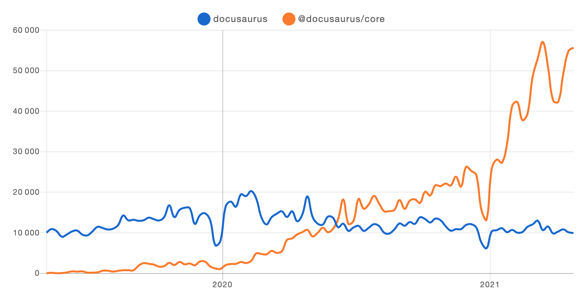

經過漫長的 alpha 階段以確保功能完整性和品質後，我們興奮地宣布正式推出首個 **[Docusaurus 2 測試版](https://github.com/facebook/docusaurus/releases/tag/v2.0.0-beta.0)**。

隨著這個測試版的發布，團隊更加確信 Docusaurus 2 已**準備好迎接主流採用**！

<!--truncate-->

## Docusaurus 採用情況

**無需畏懼測試版標籤！**

Docusaurus 2 已被廣泛採用且快速成長：

為了更全面了解當前 Docusaurus 2 網站的品質，我們的新[展示](https://docusaurus.io/showcase)頁面可讓您按功能篩選 Docusaurus 網站，從而從與您用例相似的實際生產網站中獲得靈感！

別錯過我們的[精選](https://docusaurus.io/showcase?tags=favorite)網站；它們都因獨特之處而脫穎而出：

## 為何 Docusaurus v2 的 alpha 階段如此漫長？

很難相信首個 alpha 版本 [v2.0.0-alpha.0](https://github.com/facebook/docusaurus/releases/tag/v2.0.0-alpha.0) 已是 2 年前的事 😳，這對軟體 alpha 階段來說異常漫長。

由於這是程式碼庫的重大重構，我們希望在進入測試階段前確保對 Docusaurus 2 的穩定性和功能有信心，因為測試版意味著高品質。我們很高興宣布 Docusaurus 2 已透過**[國際化 (i18n)](https://docusaurus.io/blog/2021/03/09/releasing-docusaurus-i18n)** 實現與 Docusaurus 1 的**功能對等**，並已被許多 Docusaurus 網站**成功採用**（參見 [i18n 展示](https://docusaurus.io/showcase?tags=i18n)）。

我們現在相當確信 Docusaurus 2 的核心功能已足夠穩定，可以進入測試階段。

## 測試版的目標是什麼？

既然 Docusaurus 2 已穩定且主要功能完備，測試版的目標是讓新用戶對 Docusaurus 2 的生產就緒性建立信心，將更多 Docusaurus 1 用戶遷移到版本 2，並正式棄用 Docusaurus 1。當然，我們將持續解決可能發現的任何問題和錯誤。

此外，我們將利用測試階段**改進主題系統**。

我們希望使其：

- **更容易實現自訂主題**，包括對我們自己。我們長期希望提供[多種官方主題](https://github.com/facebook/docusaurus/issues/3522)（包括 [Tailwind CSS](https://github.com/facebook/docusaurus/issues/2961)）。

- **更安全地擴展現有主題**：升級高度自訂的 Docusaurus 網站可能很痛苦，因為自訂可能與內部變更衝突。我們需要使主題公共 API 表面更明確，並清楚標示哪些部分可以安全自訂。

我們將建立更完善的**主題化基礎架構**，並重構經典主題以運用此架構。

如果您有自訂網站的需求，這些計劃中的改進將帶來顯著價值。

## 最新動態

若您尚未關注，我們近期推出了兩項重大改進：

- [自動生成側邊欄](https://docusaurus.io/docs/sidebar#sidebar-item-autogenerated)：不再需要維護 `sidebars.js` 檔案！
- [Webpack 5 / PostCSS 8](https://github.com/facebook/docusaurus/issues/4027)：持久性快取大幅提升**重建速度**！

## 未來規劃

正式推出 2.0 版本！

為達成此目標，我們將持續**修復錯誤**並實作**最受期待的功能**，包括：

- [側邊欄分類索引頁面](https://github.com/facebook/docusaurus/issues/2643)
- [優化行動裝置導覽體驗](https://github.com/facebook/docusaurus/issues/2220)
- [改進提示區塊設計](https://github.com/facebookincubator/infima/issues/55)
- [支援 CSS-in-JS](https://github.com/facebook/docusaurus/issues/3236)
- [提升建置時間效能](https://github.com/facebook/docusaurus/issues/4765)
- [擴充 Docusaurus 插件與 CMS 整合](https://github.com/facebook/docusaurus/issues/4138)
- [修正結尾斜線與相對連結問題](https://github.com/facebook/docusaurus/issues/3372)
- [強化 CommonMark 相容性](https://github.com/facebook/docusaurus/issues/3018)
- [升級至 MDX 2.0](https://github.com/facebook/docusaurus/issues/4029)

## 結語

此刻對 Docusaurus 而言是令人振奮的時刻。

我們從使用者對 Docusaurus 的[正面反饋](https://x.com/sebastienlorber/timelines/1392048416872706049)中獲得啟發，並持續在網路上發現新的應用案例。

對於此次 Beta 版的發布，我們感到無比興奮。在追求品質與穩定性的同時，我們也致力於提升 Docusaurus 的採用率。若您仍在觀望是否要將現有 Docusaurus 網站遷移至第二版，現在正是升級的最佳時機。我們希望您能在 Beta 階段結束、Docusaurus 1 正式棄用前，使用最新的基礎架構。歡迎隨時告知我們如何提供協助。

感謝所有閱讀本文的讀者，以及支持 Docusaurus 的整個社群。🤗