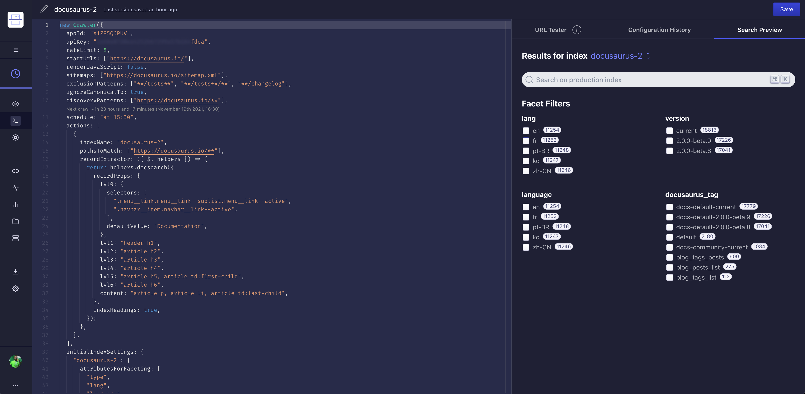

[DocSearch](https://docsearch.algolia.com/) 正在遷移至一個更強大的新系統，該系統將為用戶提供專屬的 Algolia 應用程式和新的憑證。

Docusaurus 網站擁有者應在 **2022年2月1日之前** 使用新憑證升級配置，現有搜尋索引將在此日期後凍結並變為唯讀。

<!--truncate-->

## 升級您的 Docusaurus 網站

在接下來的幾週內，Docusaurus 網站擁有者將收到一封邀請郵件，邀請他們加入其個人 Algolia 應用程式。

該郵件將包含一個新的 `appId` 和 `apiKey`，供您在 Docusaurus 配置中使用。

您只需完成以下操作：

- 加入 Algolia 應用程式（可能需要創建新的 Algolia 帳戶）
- 更新網站配置。

```js title="docusaurus.config.js"
const config = {
  themeConfig: {
    algolia: {
      // highlight-start
      appId: '<NEW_APP_ID>',
      apiKey: '<NEW_SEARCH_API_KEY>',
      // highlight-end
    },
  },
};

module.exports = config;
```

:::info

`appId` 現在是 **必填項**。

這些金鑰並非機密，可以添加到您的 Git 儲存庫中。

:::

## DocSearch 有了新家！

### 什麼是 DocSearch？

[DocSearch](https://docsearch.algolia.com/) 是由 [Algolia](http://algolia.com/) 創建的一個計劃，**免費** 為開源專案和技術部落格的技術文檔提供搜尋功能。

您可以 [在此閱讀更多資訊](https://docsearch.algolia.com/docs/what-is-docsearch/)，並 [申請](https://docsearch.algolia.com/apply) 試用！

## 這次遷移是什麼？

### 動機

隨著 [DocSearch UI](https://docsearch.algolia.com/docs/DocSearch-v3) 的穩定版即將發布，我們希望進一步為用戶提供更好的工具來改進搜尋，同時充分發揮 Algolia 的潛力。

### 有什麼新功能？

DocSearch 現在利用了 [Algolia Crawler](https://www.algolia.com/products/search-and-discovery/crawler/)，其中包括一個網頁界面，讓您可以：

- 啟動、排程和監控爬取
- 透過即時編輯器編輯配置檔案
- 使用 DocSearch v3 測試結果




此外，**在您的專屬 Algolia 應用程式中** 還可以使用更多 Algolia 功能：

- 團隊管理
- 瀏覽並查看記錄如何在 Algolia 中被索引
- 透過免費試用體驗其他 Algolia 功能


當然，還有 **更多免費功能**。

## 常見問題

### 我正在使用 Docusaurus 和 DocSearch，可以遷移嗎？ {#im-using-docusaurus-and-docsearch-can-i-migrate}

在撰寫本文時，我們仍處於遷移的早期階段。我們每週進行小批量遷移，但很快就會增加負載，請耐心等待並留意您的郵箱，您的 Algolia 應用程式準備就緒後，我們會立即聯繫您！

### 我可以在哪裡了解更多資訊？

我們撰寫了一份簡短的[遷移指南](https://docsearch.algolia.com/docs/migrating-from-legacy)，但您將在遷移電子郵件中獲得更詳細的資訊。

### 我收到了遷移郵件，但邀請已過期

請透過[電子郵件](mailto:docsearch@algolia.com)、[DocSearch的Discord](https://discord.gg/bRTacwYrfX)或[Docusaurus的Discord #algolia頻道](https://discordapp.com/invite/docusaurus)與我們聯繫。

### 我有意見要回饋！

對於我們的文檔或DocSearch UI組件的任何意見，您可以在[我們的GitHub存儲庫](https://github.com/algolia/docsearch/issues)上開一個issue，也可以透過上述方式與我們聯繫。

### 我還能運行自己的DocSearch實例嗎？

為了支持新的基礎設施和DocSearch v3，我們將不再維護我們喜愛的[DocSearch scraper](https://github.com/algolia/docsearch-scraper)和[DocSearch v2](https://github.com/algolia/docsearch/tree/master)，但這些存儲庫仍然可用並開放接受pull requests。

之前的文檔（現在稱為`legacy`）以及我們的[`運行您自己的`](https://docsearch.algolia.com/docs/legacy/run-your-own)指南仍然可用。