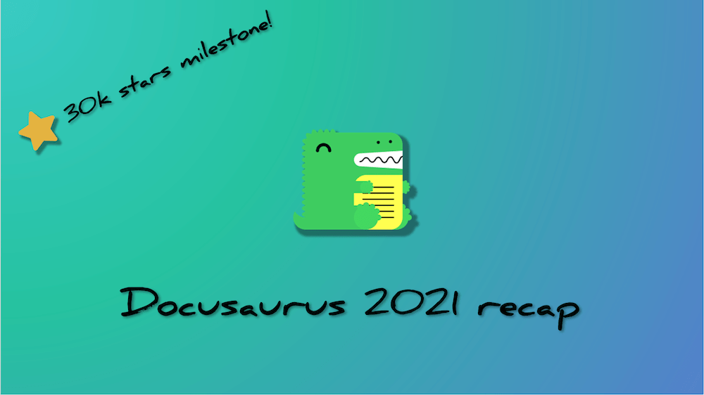

Docusaurus 在 2021 年取得了重大進展！我們見證了大量關注度，並剛突破 **GitHub 30k stars** 里程碑！

我們已實現與 v1 版本的**完整功能對等**，包括[國際化功能發佈](/blog/2021/03-09-releasing-docusaurus-i18n.mdx)、[宣佈**首個測試版**](/blog/2021/05-12-announcing-docusaurus-two-beta/index.mdx)，並在今年迎來**顯著增長的用戶群**。

**官方 v2 正式版**即將發佈！請關注[路線圖議題](https://github.com/facebook/docusaurus/issues/6113)獲取最新動態。

<!--truncate-->

## 年度亮點

讓我們先回顧今年的重要進展。還記得半年前發佈的[待辦清單](/blog/2021/05-12-announcing-docusaurus-two-beta/index.mdx#whats-next)嗎？現在正是檢視成果的時刻！

- **國際化**：自2020年底初步實裝後，歷經四個月正式發佈，現已成功應用於[眾多專案](/showcase?tags=i18n)
- **自動生成側邊欄**：不再需要維護龐大的 `sidebars.js` 文件
- **Webpack 5**：大幅提升建置效能
- **尾斜線配置**：無縫兼容各類內容託管服務
- **重新設計的行動端導航**：手機用戶現可享有與桌面版相同的導航功能
- **UI 改進**：更易讀的引用格式、優化的提示框、返回頂部按鈕...
- **部落格多作者支援**：可標註共同撰寫文章的貢獻者
- **強化部落格功能**：歸檔頁面、SEO結構化數據、饋送包含全文——快速打造功能完整的部落格
- **資源同置**：無需再使用臃腫的靜態資料夾，可將圖片與Markdown文件放在相同路徑
- **側邊欄分類索引頁**：分類標籤現在可關聯至頁面，實現更完善的文檔組織

我們的程式碼庫也持續優化，包括提升測試覆蓋率、全面遷移至TypeScript，並將發佈包體積最大縮減60%！

## 趨勢分析

### npm

Docusaurus v2 保持穩定增長，目前安裝量已是 v1 的8倍。每週下載量更實現三倍成長(+209.4%)，從1月初的28,066次攀升至12月中旬的86,846次峰值。

(啊，經典的聖誕節低谷期...)

今年共發佈18個版本，從 `2.0.0-alpha.71` 迭代至 `2.0.0-beta.14`，平均每20天就有一次更新！

### GitHub

- **星標數**: 20,460 → 29,679（年增率 +45.1%）。就在本篇部落格發布前夕，我們已突破 30k 星標！
- **總貢獻者數**: 512 → 773（年增率 +51.0%）
- **相依專案數**: v2 版本從 5,039 → 14,579（年增率 +189.3%），v1 版本從 6,311 → 7,581（年增率 +20.1%）
- **提交次數**: 過去一年共 1,187 次提交，平均每週 23 次
- **議題處理**: 新增 619 個議題，其中 505 個已解決
- [**新核心團隊成員**](https://github.com/Josh-Cena)加入（沒錯，就是我 😝）

我們的星標增長趨勢同樣亮眼。相比同類專案，我們正以**更快的速度成長**：

憑藉 8.4k 的星標增長量，我們在今年[JavaScript靜態網站生成器新星榜](https://risingstars.js.org/2021/en#section-ssg)中位列第三，僅次於Next.js與Astro。

## 精選案例

我們的展示區新增了多個["精選"站點](/showcase?tags=favorite)，充分展現Docusaurus 2可插拔架構的潛力。

- [**IOTA維基**](https://wiki.iota.org/)

- [**Dyte**](https://docs.dyte.io/docs/home/introduction/)

- [**Ionic**](https://ionicframework.com/docs)

- [**Courier**](https://www.courier.com/docs/)

Docusaurus使用者的創意超乎想像 🤩 我們期待更多採用者在發揮內容功能的同時，探索獨特的主題設計！若您的站點採用Docusaurus，歡迎[提交至展示區](https://github.com/facebook/docusaurus/edit/main/website/src/data/users.tsx)。

## 社群動態

作為[Discord](https://discord.gg/docusaurus)的活躍管理員，我清晰見證了社群的蓬勃發展。許多常見問題已整合至文件，部分功能請求也陸續實現。專案與社群形成良性循環——例如我便是從社群貢獻者晉升為維護者。

我們在X平台上持續收到激勵性反饋：

> **@docusaurus** 太驚人了！難以置信竟如此簡單易用。

> 無需額外插件、工具或編譯步驟。開箱即用。

> 我愛**@docusaurus**。若沒有它，我無法如此高效且優雅地建置網站中的API文件、教學與部落格。

我們將每一則反饋都珍藏於[我們的小盒子裡](https://x.com/sebastienlorber/timelines/1392048416872706049) 😄 如果您也喜歡Docusaurus，請繼續標記我們分享您的使用心得！

隨著正式版發佈臨近，我們希望更了解社群動態：[插件開發者](https://github.com/facebook/docusaurus/discussions/4025)、[客製化網站創作者](https://github.com/facebook/docusaurus/discussions/5468)以及[所有新用戶](https://github.com/facebook/docusaurus/discussions/4610)——請持續向我們回報成果，這將指引我們優化開發方向以滿足您的需求。

## 未來規劃

過去幾個月我們持續討論Docusaurus的候選發布階段，現在終於接近完成。我們建立了專屬[milestone](https://github.com/facebook/docusaurus/milestone/15)來追蹤進入下一階段前需解決的所有問題。簡而言之，我們希望建立**更穩健的主題工作流**，讓創意十足的站點開發者能安心客製化預設主題，無需擔心升級時的破壞性變更。這包含：

- **元件結構規範**。主題元件需具備適當顆粒度，當您需要調整網站某部分時，總能找到對應的獨立元件。
- **改進swizzle CLI工具**。讓使用者能愉悅地操作，並協助處理所有可能的元件替換情境。
- **重構主題API**。確保所有可替換元件確實適合swizzling操作，非UI元件將被重新歸類。
- **文件優化**。讓文件對各技術層級使用者都易於理解——從初學者到資深網頁開發者。我們將重組為漸進式教學架構，讓不同技能水平都能受益。

更多關於Docusaurus 2.0的規劃詳見[路線圖議題](https://github.com/facebook/docusaurus/issues/6113)。2.0版將在社群協助下成為更強大的版本，歡迎在任何milestone議題下分享您的建議！

核心團隊正全力準備正式版發佈，我們計劃在2.0後以次要版本陸續推出實用功能。甚至已規劃好[3.0版的架構變更](https://github.com/facebook/docusaurus/milestone/16)！

隨著Docusaurus 2.0正式發佈，我們預期將看到更多新採用案例與v1遷移實例。

我們要特別感謝[2021年所有貢獻者](https://github.com/facebook/docusaurus/graphs/contributors?from=2021-01-01&to=2022-01-01&type=c)，包括：

- 核心團隊：[Alexey Pyltsyn](https://github.com/lex111)、[Sébastien Lorber](https://github.com/slorber)、[Joshua Chen](https://github.com/Josh-Cena)與[Yangshun Tay](https://github.com/yangshun)負責社群管理、專案推廣、議題分類與新功能實現
- [Joel Marcey](https://github.com/JoelMarcey)創建Docusaurus並持續支持其發展
- Algolia團隊協助用戶[遷移至新版DocSearch](/blog/2021/11-21-algolia-docsearch-migration/index.mdx)並解答搜尋相關問題
- 所有活躍社群成員貢獻代碼、改進文件，並在Discord解答疑問

2021年再會，讓我們迎接更精彩的2022！