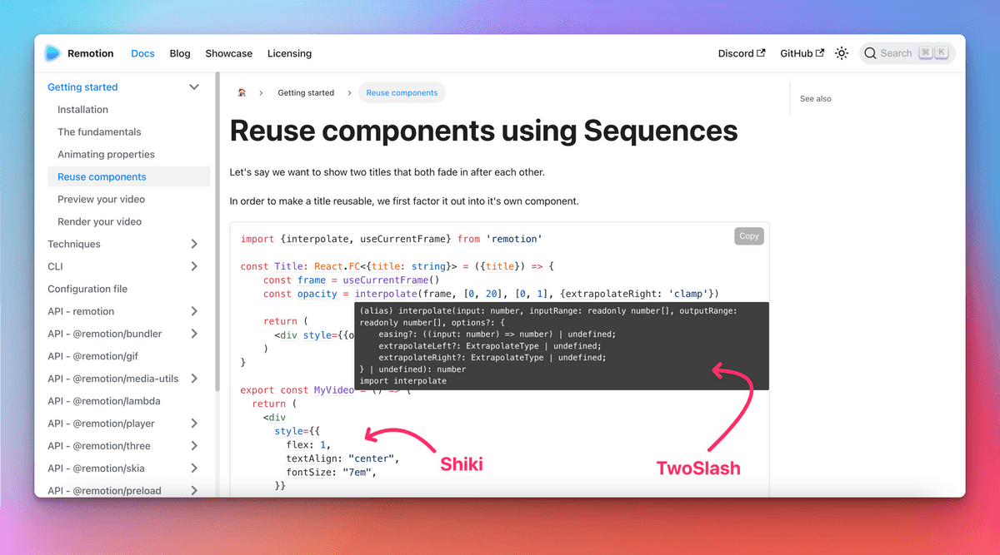

```mdx-code-block
import LiteYouTubeEmbed from 'react-lite-youtube-embed';
import 'react-lite-youtube-embed/dist/LiteYouTubeEmbed.css';
import BrowserWindow from '@site/src/components/BrowserWindow';
import ProductHuntCard from '@site/src/components/ProductHuntCard';
import HackerNewsIcon from '@site/src/components/HackerNewsIcon';
import ColorModeToggle from '@theme/Navbar/ColorModeToggle';
import useBaseUrl from '@docusaurus/useBaseUrl';
import ThemedImage from '@theme/ThemedImage';
import {ShowcaseCarouselV1, ShowcaseCarouselV2, ShowcaseCarouselV2Theming} from './ShowcaseCarousel';
```

今天我們非常高興終於能**正式宣佈 Docusaurus 2.0** 問世！🥳️

在 [**Meta 開源團隊**](https://opensource.fb.com/) 的願景中，Docusaurus 將協助您以**最小精力**打造**最出色的文件網站**，讓您專注於真正重要的事：撰寫內容。

歷經**4年開發、[75個alpha版本](https://github.com/facebook/docusaurus/releases/tag/v2.0.0-alpha.75)與[22個beta版本](https://github.com/facebook/docusaurus/releases/tag/v2.0.0-beta.22)**，新一代 Docusaurus 已**準備好迎接正式環境**。從現在起，我們將嚴格遵循**[語意化版本規範](https://semver.org/)**，並更頻繁地發布**主版本更新**。


:::info[我們登上了 [ProductHunt](https://www.producthunt.com/posts/docusaurus-2-0) 與 [Hacker News](https://news.ycombinator.com/item?id=32303052)！]

**現在**正是展現您對 Docusaurus 熱愛的最佳時機！

<div style={{display: 'flex'}}>
  <ProductHuntCard />
  <HackerNewsIcon />
</div>

:::

:::tip

趕時間？直接查看 [Docusaurus 2.0 新功能](#whats-new-in-20)！

:::

## Docusaurus 究竟是什麼？

Docusaurus 是一款**靜態網站生成器**，能協助您**快速產出精美的文件網站**。

專注於內容創作：只需撰寫**Markdown文件**。Docusaurus 將為您生成經過優化的**網站**，並可輕鬆**部署至任何平台**。

Docusaurus **功能完備**且極具**彈性**：我們提供精心設計的文件與部落格版面，開箱即用的版本控制、搜尋與國際化功能，並兼顧無障礙存取與搜尋引擎優化。其靈活的佈景主題系統可**調整UI以符合品牌形象**，完美整合至您的主網站或文件入口。採用**React**技術實現**現代化客戶端導航**，並能建構**互動式文件**。


Docusaurus 的哲學契合**帕累托法則**：您只需投入**20%的精力**即可獲得**80%的成果**。這讓您能以**最小成本**打造媲美頂尖規格的文件網站。

<TweetQuote
  url="https://x.com/rachelnabors/status/1452697991039660038"
  handle="rachelnabors"
  name="Rachel Nabors"
  job="Former ReactJS & React-Native docs manager">
  Unless you're spinning up a documentation team with engineering resources, you
  probably want Docusaurus!
</TweetQuote>

Docusaurus 致力成為**最出色的文件工具**，但您亦可將其運用於**其他場景**：部落格、知識庫、開發者作品集、第二大腦，甚至快速生成登陸頁面！

<TweetQuote
  url="https://x.com/johnny_reilly/status/1551861926334025728"
  handle="johnny_reilly"
  name="Johnny Reilly"
  job="Group Principal Engineer at Investec">
  Using Docusaurus for my tech blog has been a fantastic choice. It looks
  tremendous out-of-the-box and the awesome DX means I write way more
</TweetQuote>

:::tip

立即透過我們的[線上遊樂場](/docs/playground)與[5分鐘教學](https://tutorial.docusaurus.io/)體驗 Docusaurus ⏱️

:::

## Docusaurus 的誕生故事

Docusaurus 由**Facebook開源團隊**（現為[Meta開源團隊](https://opensource.fb.com/)）於**2017年**創建。當時我們有大量內部與開源專案需要文件化。**撰寫優質文件本身已具挑戰性**，更遑論還需打造美觀網站的HTML、CSS與JavaScript。我們希望專案負責人能**聚焦於內容**，而**Markdown**正是最佳解決方案。

當時的解決方案是**反覆複製/貼上Jekyll模板**。這自然導致**維護困難**，因此我們創建了這個工具來**一勞永逸解決痛點**。

**[Docusaurus v1 誕生了！](/blog/2017/12-14-introducing-docusaurus.mdx)**


它迅速在 Facebook 和前端生態系統中獲得動能，被許多知名專案採用，例如 [Prettier](https://prettier.io/)、[Babel](https://babeljs.io/)、[React-Native](https://archive.reactnative.dev/)、[KaTeX](https://katex.org/docs/)，當然還有 [Docusaurus v1](http://v1.docusaurus.io/) 本身。

<ShowcaseCarouselV1 />

<br />

:::note

請注意，上述範例網站雖然使用不同配色，但整體風格仍相當一致。

:::

## 邁向 Docusaurus 2.0

[**Docusaurus v1**](http://v1.docusaurus.io/) 非常成功，但我們開始**質疑某些架構決策**：

- React 僅作為**伺服器端模板語言**使用，未在客戶端發揮作用
- **主題系統相當受限**，除了透過 CSS 調整少數顏色外，難以進行進階客製化
- **文件版本控制系統令人困惑**，因其基於差異比對演算法
- 程式碼庫**過於龐雜**，既缺乏完善測試也不易擴展

[**Docusaurus v2**](https://docusaurus.io/) 經過**徹底重建**，採用全新**模組化架構**：

- React 現可同時用於客戶端，實現**現代化單頁應用導航**
- **外掛系統**讓社群能透過第三方套件貢獻實用功能
- **主題系統**比以往更**靈活**
- 文件版本控制改採快照副本機制，更易理解
- 我們保留了**v1 所有優點**：文件、部落格、頁面、版本控制、國際化...
- 並新增**多項功能**

詳見 [Docusaurus 2 專案公告](/blog/2018/09-11-Towards-Docusaurus-2.mdx) 與 [v1 至 v2 遷移指南](https://docusaurus.io/docs/migration)

## 誰在使用 Docusaurus 2.0？

儘管處於預發布階段，**Docusaurus v2 的 NPM 下載量**很快便超越了 v1：

[](https://npmtrends.com/docusaurus-vs-@docusaurus/core)

我們的 GitHub 星標增長趨勢十分亮眼，可與主流框架媲美：

[](https://star-history.com/#facebook/docusaurus&vercel/next.js&gatsbyjs/gatsby&hexojs/hexo&nuxt/nuxt.js&vuejs/vuepress&11ty/eleventy&gohugoio/hugo&remix-run/remix&mkdocs/mkdocs&Timeline)

如今，Docusaurus v2 在正式發布前已取得巨大成功：

- 我們收到許多[暖心評價](https://x.com/sebastienlorber/timelines/1392048416872706049)
- 像 [1Password](https://blog.1password.com/docusaurus-documentation-framework/) 和 [Courier](https://www.courier.com/blog/how-we-built-our-documentation/) 這樣的企業紛紛記錄他們的正面使用體驗
- 我們的[網站展示區](/showcase)收錄了數百個站點，而這僅是冰山一角

<ShowcaseCarouselV2 />

<br />

:::tip

歡迎將您的網站加入我們的[網站展示區](/showcase)！只需[在此留言](https://github.com/facebook/docusaurus/discussions/7826)，幾秒鐘即可完成。

:::

<TweetQuote
  url="https://x.com/maxlynch/status/1549415692704825346"
  handle="maxlynch"
  name="Max Lynch"
  job="Ionic co-founder and CEO">
  We use Docusaurus everywhere now and love it
</TweetQuote>

<TweetQuote
  url="https://x.com/supabase/status/1328960757149671425"
  handle="supabase"
  name="Supabase"
  job="Open Source Firebase alternative">
  We've been using V2 since January and it has been great
</TweetQuote>

<TweetQuote
  url="https://x.com/gabrielcsapo/status/1415061312917233665"
  handle="gabrielcsapo"
  name="Gabriel Csapo"
  job="Staff Software Engineer at LinkedIn">
  Docusaurus is next level easy for literally everything you would need for
  documentation in your project.
</TweetQuote>

<TweetQuote
  url="https://x.com/ItWasMattGregg/status/1526682295075102721"
  handle="ItWasMattGregg"
  name="Matt Gregg"
  job="Senior Front End Developer at Shopify">
  Docusaurus is awesome. We use it
</TweetQuote>

## 2.0 版本有哪些新功能？

很難一一列舉 Docusaurus v2 的所有新功能，我們將重點介紹最具影響力的特性。

### MDX

[MDX](https://github.com/mdx-js/mdx) 允許您在 Markdown 中**嵌入 React 組件**，這讓您能輕鬆打造頂級的**互動式文檔體驗**。

實例勝過千言萬語：

```md title="docs/my-document.mdx"
### Give it a try: press that button!

import ColorModeToggle from '@theme/ColorModeToggle';

<ColorModeToggle/>
```

```mdx-code-block
<BrowserWindow>

<h3>Give it a try: press that button!</h3>

<ColorModeToggle/>

</BrowserWindow>
```

:::info

MDX 擁有自己的[插件系統](https://mdxjs.com/docs/extending-mdx/)，您可以自訂 Markdown 撰寫體驗，甚至創建專屬的 Markdown 語法。

:::

<TweetQuote
  url="https://x.com/HamelHusain/status/1551962275250053123"
  handle="HamelHusain"
  name="Hamel Husain"
  job="Head Of Data Science at Outerbounds">
  Docusaurus + MDX is great: we were able to implement a beautiful two-pane
  layout and give the author fine-grained control on the placement of code and
  corresponding prose.
</TweetQuote>

### 文件系統慣例

我們的目標是讓 Docusaurus 使用起來非常**直觀**。我們新增了文件系統慣例，現在新增文檔頁面就像建立一個 Markdown 文件那麼簡單。

<LiteYouTubeEmbed
  id="T3S8GyFIXjo"
  params="autoplay=1&autohide=1&showinfo=0&rel=0"
  title="Explain Like I'm 5: Docusaurus"
  poster="maxresdefault"
  webp
/>

<br />

<TweetQuote
  url="https://x.com/paularmstrong/status/1552005085168865281"
  handle="paularmstrong"
  name="Paul Armstrong"
  job="Principal Engineer at Microsoft">
  Using the auto-generated sidebars makes it so simple to just create a page and
  not worry about any other configuration.
</TweetQuote>

### 插件系統

Docusaurus 現在採用**模組化架構**並提供插件系統——包括文檔、部落格、頁面和搜尋在內的**核心功能**均由獨立插件驅動。

更重要的是，這讓社群能透過插件**擴展 Docusaurus 的功能**。

以下是一些範例：

- [redocusaurus](https://github.com/rohit-gohri/redocusaurus)：無縫整合 [OpenAPI](https://www.openapis.org/) 和 [Redoc](https://github.com/Redocly/redoc)


- [docusaurus-preset-shiki-twoslash](https://www.npmjs.com/package/docusaurus-preset-shiki-twoslash)：使用 [Shiki](https://github.com/shikijs/shiki) 程式碼區塊語法高亮，並搭配 [TwoSlash](https://shikijs.github.io/twoslash/) 的 TypeScript 編譯器提示



<TweetQuote
  url="https://x.com/orta"
  handle="orta"
  name="Orta Therox"
  job="Former TypeScript core team at Microsoft">
  The plugin API was a breeze to use, and powerful enough that I could port the
  code sample renderer from the TypeScript website site in a couple of hours.
</TweetQuote>

- [docusaurus-search-local](https://github.com/easyops-cn/docusaurus-search-local)：這是內建 Algolia 插件之外的多種本地搜尋方案之一


:::tip

我們在[社群資源](/community/resources)頁面整理了精選的優質插件清單。

:::

<TweetQuote
  url="https://x.com/jodyheavener/status/1551974535452311552"
  handle="jodyheavener"
  name="Jody Heavener"
  job="Senior Developer at 1Password">
  The plugin system in Docusaurus v2 has made expanding 1Password's developer
  portal so easy and fun. Super excited to show you what we've got cooking up.
</TweetQuote>

### 主題系統

主題系統是 Docusaurus 最重要的功能之一：我們認為專業的文檔網站應該**符合企業品牌形象**，並提供一致的體驗。

Docusaurus 的主題系統在多重層級上提供極高的**靈活性**：

- 自訂 CSS 變數來調整顏色、字體等樣式
- 提供自訂的 CSS 樣式表
- 從頭實作專屬主題
- **覆寫預設主題的任何 React 組件**：我們稱此為[組件替換](https://docusaurus.io/docs/swizzling)

<TweetQuote
  url="https://x.com/hung_dev/status/1546918275065741312"
  handle="hung_dev"
  name="
Hung Viet Nguyen"
  job="Creator of JestPreview">
  I love Docusaurus Swizzling feature. It’s opinionated and flexible at the same
  time. This is super cool since a framework usually needs to sacrifice one for
  the other.
</TweetQuote>

這使得願意投入更多時間進行**自訂**的使用者能夠打造出**與眾不同**的網站外觀。

<ShowcaseCarouselV2Theming />

<TweetQuote
  url="https://x.com/dabit3/status/1382855449813389315"
  handle="dabit3"
  name="Nader Dabit"
  job="Web3 developer, Developer DAO founder">
  So far it’s working out really nicely. It’s been really easy to style up the
  way that we wanted it to look. No blockers at all.
</TweetQuote>

### 其他功能

Docusaurus 2 提供了大量實用功能：

- 主題：深色模式、更優的 UI/UX、彈性的 `themeConfig` 選項...
- 文件版本控制：可調整的插件選項以適應工作流程
- 文件側邊欄：可折疊分類、分類索引頁面...
- 部落格：多位作者、作者映射、歸檔頁面...
- Markdown：標籤頁、數學公式、即時代碼區塊、連結、彈性 front matter...
- 搜尋：使用新版 Algolia DocSearch 3 體驗
- 資源：輕鬆整合圖片與其他類型檔案
- 國際化：配置選項、預設主題翻譯...
- 無障礙：aria 標籤、色彩對比、跳至內容、鍵盤導航、漸進增強...
- SEO：合理預設值、易於自訂、標準網址、社群卡片、禁止索引、網站地圖、微資料、hreflang...
- PWA：為網站添加離線支援與可安裝功能
- 快速失敗：嚴格配置驗證、偵測失效連結、防止不良生產環境部署
- 對配置檔、插件、自訂頁面與主題作者的 TypeScript 支援
- 遊樂場：透過 [docusaurus.new](https://docusaurus.new) 在瀏覽器中輕鬆評估 Docusaurus
- Canary 版本：使用 @canary npm 標籤搶先體驗即將發佈的版本
- 測試：Docusaurus 經過完善測試，我們會實際使用功能並確保其持續運作

<TweetQuote
  url="https://x.com/alexbdebrie/status/1540010328335032320"
  handle="alexbdebrie"
  name="Alex DeBrie"
  job="AWS Data Hero, author of The DynamoDB Book">
  Recently, I was shocked at how good Docusaurus is out of the box. Super solid,
  a good bit of configuration without being overwhelming, and the ability to
  really customize the styling if you're braver than I am.
</TweetQuote>

## 為何現在推出 2.0？

許多熱情追蹤者好奇**為何我們花了 4 年才發佈 Docusaurus 2.0**，儘管測試版已相當成功且**廣泛應用於生產環境**。

原因是我們堅持**遵循[語意化版本控制](https://semver.org/)**，這意味著每當發佈**破壞性變更**時，我們就會遞增主版本號。

這點至關重要：

- 只要您僅使用[公開 API](/community/release-process#public-api-surface)，就能**保證次要版本升級簡單**
- 遵循前端生態系慣例
- 新主版本是徹底記錄破壞性變更的契機
- 新主/次版本可透過部落格文章傳達新功能

問題在於我們彈性的主題系統本質上會形成非常**隱性的 API 介面**，難以判斷何謂破壞性變更。高度客製化的 Docusaurus 網站有時升級困難，因為它們使用內部 API 實現自訂功能。我們投入時間進行主題重構並明確定義[公開 API](/community/release-process#public-api-surface)，使未來程式碼變更更安全。我們將持續擴展此公開主題 API，讓常見的網站自訂無需使用任何內部 API。

:::info

今後 Docusaurus 將**更頻繁發佈新主版本**。實際上您可預期**每 2 至 4 個月就會有新主版本**。

[主版本號並非神聖不可侵犯](https://tom.preston-werner.com/2022/05/23/major-version-numbers-are-not-sacred.html)，但我們仍會將破壞性變更集中處理，避免過於頻繁發佈主版本。

詳見我們的[發佈流程](/community/release-process)文件。

:::

## 下一步規劃？


Docusaurus 3.0 的開發已啟動，此新版本將於數月內發佈。我們會**在 Docusaurus 2.x 次要版本中反向移植相容變更**，讓社群能盡早在穩定頻道使用這些功能。

以下是我們為 Docusaurus 未來主版本規劃的部分功能：

- [升級至 MDX 2.0](https://github.com/facebook/docusaurus/issues/4029)
- [改進 Markdown 基礎設施](https://github.com/facebook/docusaurus/issues/4625)
- [改進主題與 swizzle 功能](https://github.com/facebook/docusaurus/issues/6114)
- [TailwindCSS 主題](https://github.com/facebook/docusaurus/issues/2961)
- [主題：支援導航欄、文檔側邊欄、部落格側邊欄及頁尾的自定義項目類型](https://github.com/facebook/docusaurus/issues/7227)
- [動態導航欄：導航欄項目激活策略](https://github.com/facebook/docusaurus/issues/4389)
- [自定義社交卡片](https://github.com/facebook/docusaurus/issues/2968)
- [CSS-in-JS 支援](https://github.com/facebook/docusaurus/issues/3236)
- [使用 Node.js ES 模組](https://github.com/facebook/docusaurus/issues/6520)
- [提升建置時間效能](https://github.com/facebook/docusaurus/issues/4765)
- [擴展 Docusaurus 插件與 CMS 整合](https://github.com/facebook/docusaurus/issues/4138)

## 感謝

我們想向[所有貢獻者](https://github.com/facebook/docusaurus/graphs/contributors)表達我們的感激之情，包括：

- Docusaurus 核心團隊：[Alexey Pyltsyn](https://github.com/lex111)、[Joshua Chen](https://github.com/Josh-Cena)、[Sébastien Lorber](https://github.com/slorber)、[Yangshun Tay](https://github.com/yangshun) 以及所有[前團隊成員](https://docusaurus.io/community/team)
- [Joel Marcey](https://github.com/JoelMarcey) 創建了 Docusaurus 1.0 並在 Meta 開源項目中支持 Docusaurus 2.0
- [Paul O’Shannessy](https://github.com/zpao) 在 Meta 開源項目中支持所有 Docusaurus 後續版本的開發
- [Eric Nakagawa](https://github.com/ericnakagawa) 創造了我們最可愛的吉祥物 Slash
- [Endilie Yacop Sucipto](https://github.com/endiliey) 為 Docusaurus v2 的[初期工作](/blog/2020/01-07-tribute-to-endi.mdx)做出重大貢獻
- [Clément Vannicatte](https://github.com/shortcuts)、[Kevin Granger](https://github.com/Shipow) 及整個 Algolia 團隊的支持
- 所有社群成員，包括貢獻代碼、改進文檔以及在 [Discord](https://discordapp.com/invite/docusaurus) 上回答問題的每一位

我們特別感謝所有 **Docusaurus 2.0 早期採用者**，他們評估了 alpha、beta 和 canary 版本，提供了大量**寶貴的反饋**。我們衷心希望您在使用過程中有良好的體驗，並期待您繼續為 Docusaurus 3.0 的預發布版本提供反饋。

在 [Meta 開源](https://opensource.fb.com/)中，Docusaurus 是我們**最成功的項目之一**。我們迫不及待想看到您創建的傑出文檔網站！別忘了**將它們提交到我們的[網站展示](/showcase)**！

**現在，讓您的想像力自由奔放吧 🤪！**

— Slash

:::info[我們在 [ProductHunt](https://www.producthunt.com/posts/docusaurus-2-0) 和 [Hacker News](https://news.ycombinator.com/item?id=32303052) 上！]

🙏 與社群分享您使用 Docusaurus 的經驗！

<div style={{display: 'flex'}}>
  <ProductHuntCard />
  <HackerNewsIcon />
</div>

:::

