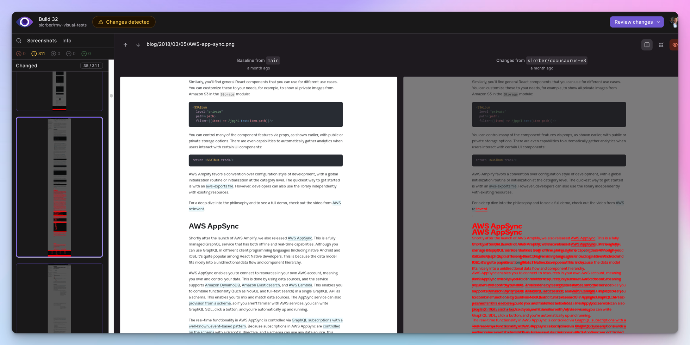

---
authors:
  - slorber
tags: [release]
slug: /upgrading-frontend-dependencies-with-confidence-using-visual-regression-testing
description: Upgrade npm dependencies with confidence thanks to a visual regression testing workflow using GitHub Actions, Playwright and Argos.
image: ./img/social-card.png
---

# 自信升級前端依賴項

前端開發者經常需要**升級 npm 依賴項**，但這些升級可能令人擔憂，並導致**常規測試套件未捕捉到的細微 UI 副作用**。

升級 Docusaurus 就是一個很好的例子：若不逐一檢查所有頁面，很難確定沒有視覺回歸問題。**Docusaurus v3 即將發布**（目前處於 [beta 階段](https://github.com/facebook/docusaurus/discussions/9312)），我們希望幫助您自信地完成此升級。

本文介紹基於 [**GitHub Actions**](https://github.com/features/actions)、[**Playwright**](https://playwright.dev/) 和 [**Argos**](https://argos-ci.com/) 的**視覺回歸測試**工作流程。該流程不直接耦合 Docusaurus 或 React，可適應其他前端應用和框架。


<!--truncate-->

此工作流程已在 Docusaurus v2 升級至 v3 過程中測試，並幫助發現 [React Native](https://reactnative.dev/)、[Jest](https://jestjs.io/) 和 [Docusaurus](https://docusaurus.io/) 官方網站等站點的視覺回歸問題。

Docusaurus v3 包含基礎架構變更和重大依賴升級（如 [MDX v3](https://mdxjs.com/blog/v3/) 和 [React 18](https://react.dev/blog/2022/03/29/react-v18)），可能產生意外副作用。若無此類工作流程，很難發現所有視覺回歸問題。因此我們建議站點管理者考慮採用視覺回歸測試，特別是高度客製化的站點。

## 工作流程概覽

核心概念非常簡單：

- 使用 [GitHub Actions](https://github.com/features/actions) 在 CI 中構建您的站點
- 使用 [Playwright](https://playwright.dev/) 對所有 `sitemap.xml` 頁面截圖
- 將截圖上傳至 [Argos](https://argos-ci.com/)
- 對 Git 分支 `main` 和 `pr-branch` 執行上述操作
- 在 [Argos](https://argos-ci.com/) 中並排比較截圖

Argos 會將 `main` 和 `pr-branch` 之間的**視覺差異**報告為 GitHub 提交狀態和拉取請求評論。這能幫助您提前自動檢測視覺回歸問題。


Argos 會創建一份報告，記錄比較兩個 Git 分支站點時發現的所有視覺差異，並提供便捷的 UX 來輕鬆識別差異。

查看 [Docusaurus Argos 頁面](https://app.argos-ci.com/meta-open-source/docusaurus) 以探索我們的網站報告。

以下是 Argos [報告視覺回歸](https://app.argos-ci.com/slorber/rnw-visual-tests/builds/32/56012838) 的具體案例，該問題在升級 React-Native 網站時發現：

[](https://app.argos-ci.com/slorber/rnw-visual-tests/builds/32/56012838)

## 工作流程實現

本節將詳細說明工作流程每個步驟的實現細節。

您需要 [註冊 Argos](https://app.argos-ci.com/signup) 並 [將 Argos 連接到您的 GitHub 倉庫](https://argos-ci.com/docs/github)

### 依賴項

此工作流程除了常規的 Docusaurus 依賴項外，還需要以下開發依賴項：

```bash
yarn add -D @argos-ci/cli @argos-ci/playwright @playwright/test cheerio
```

### GitHub Action

GitHub Action 負責為每個 Git 分支執行工作流程。

一個最小化的工作流程可能如下所示：

```yaml title=".github/workflows/argos.yml"
name: Argos CI Screenshots

on:
  push:
    branches: [main]
  pull_request:
    branches: [main]

jobs:
  take-screenshots:
    runs-on: ubuntu-latest
    steps:
      - name: Check out repository code
        uses: actions/checkout@v4

      - name: Use Node.js
        uses: actions/setup-node@v3
        with:
          node-version: current

      - name: Install dependencies
        run: yarn install --frozen-lockfile

      - name: Install Playwright browsers
        run: yarn playwright install --with-deps chromium

      - name: Build the website
        run: yarn docusaurus build

      - name: Take screenshots with Playwright
        run: yarn playwright test

      - name: Upload screenshots to Argos
        run: yarn argos upload ./screenshots
```

### Playwright 配置

Playwright 負責對先前由 GitHub Action 本地構建的網站進行截圖。

一個最小化的 [Playwright 配置](https://playwright.dev/docs/test-configuration) 可能如下所示：

```ts title="playwright.config.ts"
import {devices} from '@playwright/test';
import type {PlaywrightTestConfig} from '@playwright/test';

const config: PlaywrightTestConfig = {
  webServer: {
    port: 3000,
    command: 'yarn docusaurus serve',
  },
  projects: [
    {
      name: 'chromium',
      use: {
        ...devices['Desktop Chrome'],
      },
    },
  ],
};

export default config;
```

### Playwright 測試

僅有 Playwright 配置是不夠的：我們還需要編寫一個 Playwright 測試文件來生成網站截圖。

```ts title="screenshot.spec.ts"
import * as fs from 'fs';
import {test} from '@playwright/test';
import {argosScreenshot} from '@argos-ci/playwright';
import {extractSitemapPathnames, pathnameToArgosName} from './utils';

// Constants
const siteUrl = 'http://localhost:3000';
const sitemapPath = './build/sitemap.xml';
const stylesheetPath = './screenshot.css';
const stylesheet = fs.readFileSync(stylesheetPath).toString();

// Wait for hydration, requires Docusaurus v2.4.3+
// Docusaurus adds a <html data-has-hydrated="true"> once hydrated
// See https://github.com/facebook/docusaurus/pull/9256
function waitForDocusaurusHydration() {
  return document.documentElement.dataset.hasHydrated === 'true';
}

function screenshotPathname(pathname: string) {
  test(`pathname ${pathname}`, async ({page}) => {
    const url = siteUrl + pathname;
    await page.goto(url);
    await page.waitForFunction(waitForDocusaurusHydration);
    await page.addStyleTag({content: stylesheet});
    await argosScreenshot(page, pathnameToArgosName(pathname));
  });
}

test.describe('Docusaurus site screenshots', () => {
  const pathnames = extractSitemapPathnames(sitemapPath);
  console.log('Pathnames to screenshot:', pathnames);
  pathnames.forEach(screenshotPathname);
});
```

<details>
  <summary>Why do we take screenshots with Argos instead of Playwright?</summary>

Argos has a [Playwright integration](https://argos-ci.com/docs/playwright) that wraps the original Playwright screenshot API and provides better defaults to make screenshots more deterministic.

</details>

<details>
<summary>What's inside <code>utils.ts</code>?</summary>

This module contains implementation details that we choose to hide for clarity.

```ts
import * as cheerio from 'cheerio';
import * as fs from 'fs';

// Extract a list of pathnames, given a fs path to a sitemap.xml file
// Docusaurus generates a build/sitemap.xml file for you!
export function extractSitemapPathnames(sitemapPath: string): string[] {
  const sitemap = fs.readFileSync(sitemapPath).toString();
  const $ = cheerio.load(sitemap, {xmlMode: true});
  const urls: string[] = [];
  $('loc').each(function handleLoc() {
    urls.push($(this).text());
  });
  return urls.map((url) => new URL(url).pathname);
}

// Converts a pathname to a decent screenshot name
export function pathnameToArgosName(pathname: string): string {
  return pathname.replace(/^\/|\/$/g, '') || 'index';
}
```

</details>

### 樣式表

截圖並不總是確定性的，對同一頁面進行兩次截圖可能會導致細微的變化，這些變化會被 Argos 報告為 **假陽性** 視覺回歸。

因此，我們建議注入一個額外的樣式表來隱藏有問題的元素。根據您自己網站上發現的不穩定元素，您可能需要向此基礎樣式表中添加新的 CSS 規則。詳情請參閱 [Argos - 關於不穩定測試的文檔](https://argos-ci.com/docs/about-flaky)。

```css title="screenshot.css"
/* Iframes can load lazily */
iframe,
/* Avatars can be flaky due to using external sources: GitHub/Unavatar */
.avatar__photo,
/* Gifs load lazily and are animated */
img[src$='.gif'],
/* Algolia keyboard shortcuts appear with a little delay */
.DocSearch-Button-Keys > kbd,
/* The live playground preview can often display dates/counters */
[class*='playgroundPreview'] {
  visibility: hidden;
}

/* Different docs last-update dates can alter layout */
.theme-last-updated,
/* Mermaid diagrams are rendered client-side and produce layout shifts */
.docusaurus-mermaid-container {
  display: none;
}
```

:::tip[防止佈局偏移]

我們建議使用 `display: none;` 來隱藏影響佈局的不穩定 UI 元素。

例如，文檔的「最後更新於」可能會渲染超過 1 行，最終「推」下其餘內容，導致 Argos 檢測到許多不同的像素。

:::

## 示例倉庫

[slorber/docusaurus-argos-example](https://github.com/slorber/docusaurus-argos-example) 倉庫展示了一個完整的示例，該示例在一個新初始化的 Docusaurus v2 網站上實現了此工作流程，並使用了 Yarn monorepo。

[](https://github.com/slorber/docusaurus-argos-example)

相關的拉取請求：

- [PR - 設置 GitHub Action + Playwright + Argos](https://github.com/slorber/docusaurus-argos-example/pull/1)：實現了上述最小化工作流程
- [PR - 從 Docusaurus v2 升級到 v3](https://github.com/slorber/docusaurus-argos-example/pull/2)：展示了 Argos 在升級過程中捕獲的 3 個視覺回歸

:::tip[更進階的示例？]

瀏覽 Docusaurus 倉庫以獲得更進階的集成：

- [GitHub Action](https://github.com/facebook/docusaurus/blob/main/.github/workflows/argos.yml)
- [Playwright + Argos 測試](https://github.com/facebook/docusaurus/tree/main/argos)

:::

## 降低成本

我們選擇的工具是此視覺回歸測試工作流程的實現細節。

對於 Docusaurus，我們選擇了 [Argos](https://argos-ci.com/)：它對我們來說效果很好，並提供 [免費](https://argos-ci.com/pricing) 和 [開源](https://argos-ci.com/docs/open-source) 計劃。然而，您可以自由選擇其他工具。

如果您不介意在 Git 中存儲大型截圖，您也可以嘗試免費、自託管的 [Playwright 視覺比較](https://playwright.dev/docs/test-snapshots)，並使用 `npx playwright show-report` 瀏覽視覺差異。然而，我們發現使用專用的外部工具更加方便。

外部工具可能價格昂貴，但通常提供免費方案並配備充足的截圖配額。您可以透過以下幾種技巧來減少截圖消耗量。

### 限制路徑名稱數量

基礎設定會對`sitemap.xml`中的每個路徑名稱進行截圖。對於大型網站來說，這可能導致大量截圖。

您可以選擇過濾路徑名稱，僅針對最關鍵的頁面進行截圖。

對於Docusaurus網站，請勿對版本化文件頁面進行截圖：

```ts title="screenshot.spec.ts"
// highlight-start
function isVersionedDocsPathname(pathname: string): boolean {
  return pathname.match(/^\/docs\/((\d\.\d\.\d)|(next))\//);
}
// highlight-end

test.describe('Docusaurus site screenshots', () => {
  const pathnames = extractSitemapPathnames(sitemapPath)
    // highlight-next-line
    .filter(isVersionedDocsPathname);

  pathnames.forEach(screenshotPathname);
});
```

### 限制工作流程並發數

實施[GitHub Actions並發群組](https://docs.github.com/en/actions/using-jobs/using-concurrency)可防止連續提交觸發多個無效的工作流程執行。工作流程僅會針對最後一次提交執行，之前的提交將自動取消。

```yaml title=".github/workflows/argos.yml"
concurrency:
  group: ${{ github.workflow }}-${{ github.head_ref || github.run_id }}
  cancel-in-progress: true
```

### 有條件地執行工作流程

沒必要針對每次提交和拉取請求都執行此工作流程。

例如，如果有人修正了您文檔中的拼寫錯誤，您可能不希望拍攝數百張截圖並讓Argos指出只有修改過的頁面存在視覺差異：這本來就是預期結果！

對於Docusaurus網站，我們僅針對帶有`Argos`標籤的拉取請求執行工作流程：

```yaml title=".github/workflows/argos.yml"
name: Argos CI Screenshots

on:
  push:
    branches: [main]
  pull_request:
    branches: [main]
    # highlight-start
    types:
      - opened
      - synchronize
      - reopened
      - labeled
    # highlight-end

jobs:
  take-screenshots:
    # highlight-start
    if: ${{ github.ref_name == 'main' || (github.event_name == 'pull_request' && contains(github.event.pull_request.labels.*.name, 'Argos')) }}
    # highlight-end
    runs-on: ubuntu-latest
    steps:
      # Your job steps here ...
```

還有許多選項可供探索，例如[手動觸發工作流程](https://docs.github.com/en/actions/using-workflows/manually-running-a-workflow)或[僅當修改符合特定模式的文件時觸發](https://docs.github.com/en/actions/using-workflows/triggering-a-workflow#example-including-paths)。

## 結論

我認為**視覺回歸測試在前端生態系統中未被充分利用**。

拍攝全頁截圖是**唾手可得的成果**，易於設置且能幫助您**捕捉常規測試套件會遺漏的新型錯誤**。這項技術不僅適用於npm套件升級，也適用於**任何不應改變用戶界面的重構工作**。

何不嘗試看看呢？

祝您開發愉快！

## 另請參閱

實用文件連結：

- [Playwright - 安裝指南](https://playwright.dev/docs/intro)
- [Playwright - 測試配置指南](https://playwright.dev/docs/test-configuration)
- [Playwright - 測試配置API](https://playwright.dev/docs/api/class-testconfig)
- [Argos - 安裝指南](https://argos-ci.com/docs/installation)
- [Argos - 與GitHub Actions搭配使用](https://argos-ci.com/docs/github-actions)
- [Argos - 與Playwright搭配使用](https://argos-ci.com/docs/playwright)
- [Argos - 關於不穩定測試](https://argos-ci.com/docs/about-flaky)