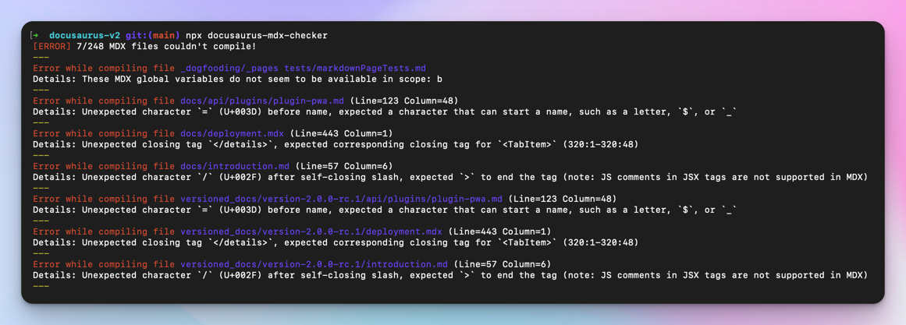

:::warning

本部落格文章撰寫時 Docusaurus v3 尚處於測試版。若您要升級至目前穩定版的 Docusaurus v3，請注意相關依賴套件版本與升級步驟已有變更。請參閱[升級指南](https://docusaurus.io/docs/next/migration/v3)以獲取最新的遷移步驟。

:::

**Docusaurus v3** 目前已進入[測試階段](https://github.com/facebook/docusaurus/discussions/9312)，正式版即將發布。現在正是開始為您網站**預備升級**的最佳時機。

Docusaurus v3 帶來若干**重大變更**，其中許多可於 Docusaurus v2 階段**先行處理**。提前逐步準備網站升級工作，將使後續升級至 v3 更加順利。

最主要的變更是從 MDX v1 升級至 MDX v3。請詳閱 [MDX v2](https://mdxjs.com/blog/v2/) 與 [MDX v3](https://mdxjs.com/blog/v3/) 的版本發布說明。新版 MDX 將以**更嚴格的標準**編譯您的 Markdown 內容，且會產生**細微差異**。

本文將重點說明如何為新版 MDX 準備內容，並列出其他可立即處理的重大變更。


<!--truncate-->

:::warning

本文提及多數 Docusaurus v3 的重大變更，但未盡完整。請參閱 [v3.0.0-beta.0 版本發布說明](https://github.com/facebook/docusaurus/discussions/9312)以獲取完整清單。

:::

:::tip[無需擔憂]

本篇部落格文章內容雖多，但多數 Docusaurus v2 網站只需極少修改即可升級。

若您的網站規模較小且自訂程度低，或許能[立即升級至 Docusaurus v3](#try-docusaurus-v3-today)。

:::

## 準備工作

在準備升級至 Docusaurus v3 前，建議先升級至最新版 [Docusaurus v2](/versions)。

視網站複雜度而定，建議採用我們近期介紹的[視覺回歸測試工作流程](/blog/upgrading-frontend-dependencies-with-confidence-using-visual-regression-testing)。此方法可協助您偵測 Docusaurus v3 升級過程中可能出現的意外視覺副作用。

當您在 Markdown 檔案中使用 JSX、`import` 或 `export`（即 MDX 功能）時，建議統一採用 `.mdx` 副檔名。此舉更符合語意且能提升與外部工具（整合開發環境、格式化工具、檢查工具等）的相容性。未來 Docusaurus 版本中，`.md` 檔案將以標準 [CommonMark](https://commonmark.org/) 格式解析，不再支援前述功能。Docusaurus v3 仍將 `.md` 檔案編譯為 MDX 格式，但可[選擇啟用 CommonMark](https://github.com/facebook/docusaurus/issues/3018)。

## 為 MDX v3 準備內容

MDX 是 Docusaurus 的核心依賴套件，負責將您的 `.md` 與 `.mdx` 檔案編譯為 React 元件。

MDX v3 雖大幅改進，但伴隨的變更可能需要您調整現有內容。新版 MDX 更加嚴格，某些在 v1 能正常編譯的元件，可能因 `{` 和 `<` 字元導致 v3 編譯失敗。

升級 MDX 會帶來 [MDX v2](https://mdxjs.com/blog/v2/) 和 [MDX v3](https://mdxjs.com/blog/v3/) 發布部落格文章中記載的所有破壞性變更。大多數破壞性變更來自 MDX v2。[MDX v2 遷移指南](https://mdxjs.com/migrating/v2/)中有關於如何[更新 MDX 文件](https://mdxjs.com/migrating/v2/#update-mdx-files)的章節，這對我們特別重要。同時請務必閱讀[MDX 疑難排解](https://mdxjs.com/docs/troubleshooting-mdx/)頁面，該頁面可幫助你解讀常見的 MDX 錯誤訊息。

請同時閱讀我們更新的 [**MDX 與 React**](/docs/markdown-features/react) 文件頁面。

:::tip[尋求協助]

我們有一個專門的 [MDX v3 - 升級支援](https://github.com/facebook/docusaurus/discussions/9053)討論串。

:::

### 使用 MDX 遊樂場

MDX 遊樂場是你新的最佳夥伴。它能幫助你理解你的內容如何**被編譯為 React 元件**，並在隔離環境中排查編譯或渲染問題。

每個 MDX 版本都有其專屬的遊樂場：

- [MDX 遊樂場 - 當前版本](https://mdxjs.com/playground/)
- [MDX 遊樂場 - v1](https://mdx-git-renovate-babel-monorepo-mdx.vercel.app/playground/)

<details>
  <summary>Configuring the MDX playground options for Docusaurus</summary>

To obtain a compilation behavior similar to what Docusaurus v2 uses, please turn on these options on the [MDX playground](https://mdxjs.com/playground/):

- Use `MDX`
- Use `remark-gfm`
- Use `remark-directive`


</details>

同時使用兩個 MDX 遊樂場，你很快就會發現某些內容在 v3 中的編譯方式不同或無法編譯。

:::tip[讓你的內容具備未來兼容性]

目標是重構有問題的內容，使其**在兩個 MDX 版本中都能正常運作**。這樣當你升級到 Docusaurus v3 時，這些內容就能直接使用。

:::

### 使用 MDX 檢查器 CLI

我們提供了一個 [docusaurus-mdx-checker](https://github.com/slorber/docusaurus-mdx-checker) CLI 工具，可輕鬆找出有問題的內容。現在就在你的 Docusaurus v2 網站上運行此命令，獲取在 MDX v3 下會編譯失敗的文件清單。

```bash
npx docusaurus-mdx-checker
```

對於每個編譯問題，CLI 會記錄文件路徑和需要查看的行號。



:::tip

使用此 CLI 來評估讓你的內容兼容 MDX v3 所需的工作量。

:::

:::warning

此 CLI 是盡力而為的工具，僅會報告編譯錯誤。

它不會報告那些不產生錯誤但可能影響內容顯示的細微編譯變化。要捕捉這些問題，我們建議使用[視覺回歸測試](/blog/upgrading-frontend-dependencies-with-confidence-using-visual-regression-testing)。

:::

### 常見 MDX 問題

我們已將幾個 Docusaurus 網站升級到 Docusaurus v3 和 MDX v3：

- [Docusaurus PR](https://github.com/facebook/docusaurus/pull/8288)
- [React-Native PR](https://github.com/facebook/react-native-website/pull/3780)
- [Jest PR](https://github.com/jestjs/jest/pull/14463)

這些升級讓我們能彙整最常見的內容問題，並記錄最佳處理方式。

#### 錯誤使用 `{`

`{` 字元用於開啟 [JavaScript 表達式](https://mdxjs.com/docs/what-is-mdx/#expressions)。如果 `{expression}` 中的內容不是有效表達式，MDX 現在會報錯。

```md title="example.md"
The object shape looks like {username: string, age: number}
```

:::danger[錯誤訊息]

> 無法使用 acorn 解析表達式：表達式後出現意外內容

:::

:::tip[如何準備]

可用的修復選項：

- 使用行內程式碼：`{username: string, age: number}`
- 使用 HTML 代碼：`&#123;`
- 進行跳脫：`\{`

:::

#### 錯誤使用 `<`

`<` 字元用於開啟 [JSX 標籤](https://mdxjs.com/docs/what-is-mdx/#jsx)。若 MDX 認為你的 JSX 無效，現在會直接報錯。

```md title="example.md"
Use Android version <5

You can use a generic type like Array<T>

Follow the template "Road to <YOUR_MINOR_VERSION>"
```

:::danger[錯誤訊息]

> 在名稱前出現意外字元 `5` (U+0035)，預期應為可作為名稱開頭的字元，如字母、`$` 或 `_`

> 在 `paragraph` 結束前預期應有 `<T>` (1:6-1:9) 的閉合標籤 (end-tag-mismatch mdast-util-mdx-jsx)

> 在 `paragraph` 結束前預期應有 `<YOUR_MINOR_VERSION>` (134:19-134:39) 的閉合標籤

:::

:::tip[如何準備]

可用的修復選項：

- 使用行內程式碼：`Array<T>`
- 使用 HTML 代碼：`&lt;` 或 `&#60;`
- 進行跳脫：`\<` (注意：在 MDX v1 下反斜線 `\` 會顯示出來)

:::

#### 錯誤使用 GFM 自動連結

Docusaurus 支援 [GitHub 風味 Markdown (GFM)](https://github.github.com/gfm/)，但 MDX 不再支援使用 `<link>` 語法的[自動連結](https://github.github.com/gfm/#autolinks)。

```md title="example.md"
<sebastien@thisweekinreact.com>

<http://localhost:3000>
```

:::danger[錯誤訊息]

> 名稱中出現意外字元 `@` (U+0040)，預期應為名稱字元如字母、數字、`$` 或 `_`；屬性前的空白；或標籤結尾 (注意：在 MDX 中建立連結請使用 `[文字](網址)`)

> 在本地名稱前出現意外字元 `/` (U+002F)，預期應為可作為名稱開頭的字元，如字母、`$` 或 `_` (注意：在 MDX 中建立連結請使用 `[文字](網址)`)

:::

:::tip[如何準備]

使用標準 Markdown 連結，或移除 `<` 和 `>`。MDX 和 GFM 已能自動連結純文字。

{/* prettier-ignore */}
```md title="example.md"
sebastien@thisweekinreact.com
[sebastien@thisweekinreact.com](mailto:sebastien@thisweekinreact.com)

http://localhost:3000
[http://localhost:3000](http://localhost:3000)
```

:::

#### 小寫的 MDXComponent 映射

對於提供[自訂 `MDXComponent` 映射](/docs/markdown-features/react#mdx-component-scope)的使用者，元件現在會被「沙盒化」：

- `h1` 的 `MDXComponent` 映射僅適用於 `# hi`，而不適用於 `<h1>hi</h1>`
- **小寫**的自訂元件名稱將不再被其對應的 `MDXComponent` 元件替換

:::danger[視覺差異]

你的 [`MDXComponent` 元件映射](/docs/markdown-features/react#mdx-component-scope)可能不會像以前那樣生效，且自訂元件可能不再被使用。

:::

:::tip[如何準備]

對於原生 Markdown 元素，您可以繼續使用**小寫**：`p`、`h1`、`img`、`a`...

對於其他任何元素，**請使用大寫名稱**。

```diff title="src/theme/MDXComponents.js"
 import MDXComponents from '@theme-original/MDXComponents';

 export default {
   ...MDXComponents,
   p: (props) => <p {...props} className="my-paragraph"/>
-  myElement: (props) => <div {...props} className="my-class" />,
+  MyElement: (props) => <div {...props} className="my-class" />,
 };
```

:::

#### 非預期的額外段落

在 MDX 中，現在可以更輕鬆地交錯使用 JSX 和 Markdown，而無需額外的換行。在多行上編寫內容也可能產生新的預期 `<p>` 標籤。

:::danger[視覺差異]

請看這段內容在 MDX v1 和 v3 中的渲染差異。

```md title="example.md"
<div>Some **Markdown** content</div>
<div>
  Some **Markdown** content
</div>
```

{/* prettier-ignore */}
```html title="MDX v1 輸出"
<div>Some **Markdown** content</div>
<div>Some **Markdown** content</div>
```

{/* prettier-ignore */}
```html title="MDX v3 輸出"
<div>Some <strong>Markdown</strong> content</div>
<div><p>Some <strong>Markdown</strong> content</p></div>
```

:::

:::tip[如何準備]

如果您不希望有額外的 `<p>` 標籤，請根據具體情況重構內容，使用單行 JSX 標籤。

```diff
 <figure>
   
-  <figcaption>
-    My image caption
-  </figcaption>
+  <figcaption>My image caption</figcaption>
 </figure>
```

如果您的內容包含「Markdown 內聯元素」（`**`、`*`、`_`、`[link](/path)`），您可能無法提前重構，需要在升級到 Docusaurus v3 時一併處理。

:::

#### 非預期的指令使用

Docusaurus v3 現在使用 [Markdown 指令](https://talk.commonmark.org/t/generic-directives-plugins-syntax/444)（通過 [remark-directive](https://github.com/remarkjs/remark-directive) 實現）作為一種通用方式來支持 admonitions 和其他即將推出的 Docusaurus 功能。

```md title="example.md"
This is a :textDirective

::leafDirective

:::containerDirective

Container directive content

:::
```

:::danger[視覺變化]

指令會被解析並由其他 Remark 插件處理。未處理的指令將被忽略，並且不會以其原始形式渲染。

```md title="example.md"
The AWS re:Invent conf is great
```

由於 `:Invent` 被解析為文本指令，現在將渲染為：

```
The AWS re
conf is great
```

:::

:::tip[如何準備]

- 使用 HTML 代碼：`&#58;`
- 在 `:` 後添加空格（如果合理）：`: text`
- 轉義它：`\:`（不幸的是，在 MDX v1 下會顯示 `\`）

:::

#### 不支援的縮進代碼塊

MDX 不再將縮進文本轉換為代碼塊。

```md title="example.md"
    console.log("hello");
```

:::danger[視覺變化]

升級通常不會產生新的 MDX 編譯錯誤，但可能導致內容以非預期的方式渲染，因為不再有代碼塊。

:::

:::tip[如何準備]

使用常規的代碼塊語法代替縮進：

````md title="example.md"
```js
console.log('hello');
```
````

:::

### MDX 插件

MDX生態系統中的所有官方套件（Unified、Remark、Rehype等）現已[**僅支援ES模組**](https://gist.github.com/sindresorhus/a39789f98801d908bbc7ff3ecc99d99c)，不再支援[CommonJS](https://nodejs.org/api/modules.html#modules-commonjs-modules)。

這實際上意味著您不能再使用`require("remark-plugin")`。

:::tip[準備方法]

Docusaurus v3現在支援[**ES模組**](https://flaviocopes.com/es-modules/)設定檔。我們建議您將設定檔遷移到ES模組，這樣可以輕鬆導入Remark外掛：

```js title="docusaurus.config.js"
import remarkPlugin from 'remark-plugin';

export default {
  title: 'Docusaurus',
  /* 在此使用Remark外掛的網站設定 */
};
```

如果您想繼續使用CommonJS模組，可以使用動態導入作為變通方法，這樣可以在CommonJS模組中導入ES模組。幸運的是，[Docusaurus設定支援使用非同步函式](/docs/configuration#syntax-to-declare-docusaurus-config)來實現這一點。

```js title="docusaurus.config.js"
module.exports = async function () {
  const myPlugin = (await import('remark-plugin')).default;
  return {
    // 網站設定...
  };
};
```

:::

:::info[給外掛開發者]

如果您創建了自定義的Remark或Rehype外掛，由於新的AST結構，您可能需要重構這些外掛，甚至完全重寫它們。我們已創建一個[專屬支援討論](https://github.com/facebook/docusaurus/discussions/9337)來幫助外掛開發者升級他們的代碼。

:::

## 其他重大變更

除了MDX之外，還有其他重大變更，您可以提前為您的網站做好準備，特別是重要依賴項的主要版本升級。

### Node.js 18.0

Node.js 16[已達到生命週期終止](https://nodejs.org/en/blog/announcements/nodejs16-eol)，Docusaurus v3現在需要**Node.js >= 18.0**。

:::tip[準備方法]

在升級到Docusaurus v3之前，先將您的Docusaurus v2網站升級到Node.js 18。

:::

### React 18.0

Docusaurus v3現在需要**React >= 18.0**。

React 18帶來了自己的重大變更，根據您為網站創建的自定義React代碼量，這些變更應該相對容易處理。

僅使用我們的官方主題代碼且未進行swizzling的簡單Docusaurus網站無需任何操作。

:::tip[準備方法]

閱讀官方的[React v18.0](https://react.dev/blog/2022/03/29/react-v18)和[如何升級到React 18](https://react.dev/blog/2022/03/08/react-18-upgrade-guide)，並查看您的一手React代碼，以確定哪些組件可能受到此React 18升級的影響。

我們特別建議關注：

- 有狀態組件的自動批次處理
- 控制台報告的新React水合錯誤

:::

### TypeScript 5.0

Docusaurus v3現在需要**TypeScript >= 5.0**。

:::tip[準備方法]

在升級到Docusaurus v3之前，先將您的Docusaurus v2網站升級到TypeScript 5。

:::

### TypeScript基礎設定

官方的Docusaurus TypeScript設定已從外部套件[`@tsconfig/docusaurus`](https://www.npmjs.com/package/@tsconfig/docusaurus)重新內部化到我們的新monorepo套件[`@docusaurus/tsconfig`](https://www.npmjs.com/package/@docusaurus/tsconfig)。

這個新套件版本與所有其他 Docusaurus 核心套件同步更新，將用於確保 TypeScript 的向下相容性及處理主要版本升級時的破壞性變更。

:::tip[如何準備]

新的 Docusaurus v3 TypeScript 配置基本上與舊版 Docusaurus v2 的配置相同。若您已升級至 TypeScript 5，在 v2 站點上使用 Docusaurus v3 配置已是可行的：

```diff title="package.json"
 {
   "devDependencies": {
-    "@tsconfig/docusaurus": "^1.0.7",
+    "@docusaurus/tsconfig": "^3.0.0-beta.0",
   }
 }
```

```diff title="tsconfig.json"
 {
-  "extends": "@tsconfig/docusaurus/tsconfig.json",
+  "extends": "@docusaurus/tsconfig",
   "compilerOptions": {
     "baseUrl": "."
   }
 }
```

:::

### 警告提示框變更

由於歷史原因，我們曾支援一個未公開的 `:::warning` 提示框，其會以紅色呈現。

:::danger[警告]

這是 Docusaurus v2 的 `:::warning` 提示框。

:::

然而，其顏色與圖標在歷史上並不正確。Docusaurus v3 正式重新引入 `:::warning` 提示框，將其文件化，並修正了顏色與圖標。

:::warning

這是 Docusaurus v3 的 `:::warning` 提示框。

:::

:::tip[如何準備]

若您先前使用了未公開的 `:::warning` 提示框，請確保檢查每個使用處，確認黃色是否現在為合適的顏色。若您希望維持紅色，請改用 `:::danger`。

Docusaurus v3 也[棄用了 `:::caution`](https://github.com/facebook/docusaurus/pull/9308) 提示框。請將 `:::caution`（黃色）重構為 `:::warning`（黃色）或 `:::danger`（紅色）。

:::

### 版本化側邊欄

此破壞性變更僅會影響 **Docusaurus v2 早期採用者**，即在 `v2.0.0-beta.10`（2021 年 12 月）之前對其文件進行版本化的使用者。

當建立版本 `v1.0.0` 時，側邊欄檔案包含前綴 `version-v1.0.0/`，而 [Docusaurus v3 不再支援此格式](https://github.com/facebook/docusaurus/pull/9310)。

```json title="versioned_sidebars/version-v1.0.0-sidebars.json"
{
  "version-v1.0.0/docs": [
    "version-v1.0.0/introduction",
    "version-v1.0.0/prerequisites"
  ]
}
```

:::tip[如何準備]

您的 Docusaurus v2 站點能夠以類似方式處理兩種側邊欄格式。

您可以從版本化側邊欄中移除無用的版本前綴。

```json title="versioned_sidebars/version-v1.0.0-sidebars.json"
{
  "docs": ["introduction", "prerequisites"]
}
```

:::

## 立即試用 Docusaurus v3 {#try-docusaurus-v3-today}

Docusaurus v3 目前處於 [beta 階段](https://github.com/facebook/docusaurus/discussions/9312)，並已被 [React-Native](https://reactnative.dev)、[Jest](https://jestjs.io) 及[我們的官方網站](https://docusaurus.io/) 用於生產環境。

我們認為此新版 Docusaurus **穩定且已準備好部署至生產環境**。在獲得社群早期採用者的正面回饋後，將很快正式發布。

若您嘗試升級並在 [3.0.0-beta.0 發布討論串](https://github.com/facebook/docusaurus/discussions/9312) 回報問題，我們將非常感激。

對大多數站點而言，升級應相當簡單。若您已依照本文檔提前準備好站點，升級以下相依套件應已足夠：

```diff title="package.json"
 {
   "dependencies": {
-    "@docusaurus/core": "2.4.3",
-    "@docusaurus/preset-classic": "2.4.3",
-    "@mdx-js/react": "^1.6.22",
+    "@docusaurus/core": "3.0.0-beta.0",
+    "@docusaurus/preset-classic": "3.0.0-beta.0",
+    "@mdx-js/react": "^3.0.0",
     "clsx": "^2.0.0",
     "prism-react-renderer": "^1.3.5",
-    "react": "^17.0.2",
-    "react-dom": "^17.0.2"
+    "react": "^18.2.0",
+    "react-dom": "^18.2.0"
   },
   "devDependencies": {
-    "@docusaurus/module-type-aliases": "2.4.3"
+    "@docusaurus/module-type-aliases": "3.0.0-beta.0"
   }
 }
```

## 尋求協助

我們將透過以下支援管道協助您完成升級：

- [Docusaurus v3 - 升級支援](https://github.com/facebook/docusaurus/discussions/9336)
- [Docusaurus v3 - Discord 頻道 #migration-v2-to-v3](https://discord.com/channels/398180168688074762/1154771869094912090)
- [MDX v3 - 升級支援](https://github.com/facebook/docusaurus/discussions/9053)
- [MDX v3 - Remark/Rehype 插件支援](https://github.com/facebook/docusaurus/discussions/9337)
- [MDX v3 - Discord 頻道 #migration-mdx-v3](https://discord.com/channels/398180168688074762/1116724556976111616)

或者，您可以尋找付費的 [Docusaurus 服務供應商](https://github.com/facebook/docusaurus/discussions/9281) 代為執行升級。若您的專案是開源的，也可向社群尋求 [免費的善意協助](https://github.com/facebook/docusaurus/discussions/9283)。

## 結論

Docusaurus v3 已進入可試用階段，即將正式發布。本文已詳述升級所需的主要變更事項。

3.0 初始版本聚焦於依賴項與基礎架構升級，這些改進將為後續新功能鋪路。同時也包含若干實用特性，我們將在最終版發布說明中詳細說明。