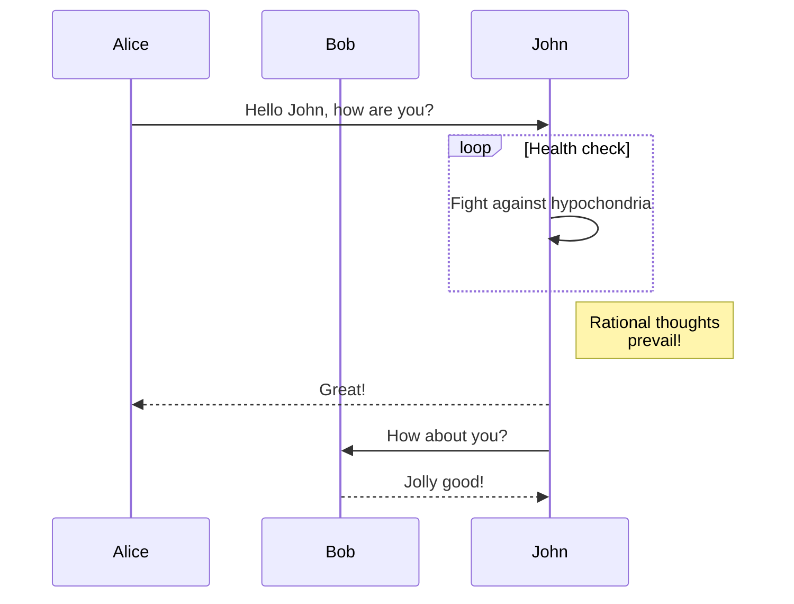

我們很高興宣布 **Docusaurus 2.2** 正式發布。

升級過程應該很簡單：如我們的[發布流程文件](/community/release-process)所述，次要版本遵循[語意化版本控制](https://semver.org/)規範。


## 重點功能

### Mermaid 圖表

在 [#7490](https://github.com/facebook/docusaurus/pull/7490) 中，我們新增了對 Mermaid 圖表的支援。這補足了 GitHub Flavored Markdown 近期也[新增的支援功能](https://github.blog/2022-02-14-include-diagrams-markdown-files-mermaid/)。您可以使用 Markdown 代碼區塊來建立 Mermaid 圖表：

````md

````

````mdx-code-block
import BrowserWindow from '@site/src/components/BrowserWindow';

<BrowserWindow>


</BrowserWindow>

````

請務必查閱[說明文件](/docs/markdown-features/diagrams)以及[進階範例](/tests/pages/diagrams)

### 設定 `headTags`

在 [#8151](https://github.com/facebook/docusaurus/pull/8151) 中，我們新增了為網站所有頁面套用任意 HTML `<head>` 標籤的功能。

```js title="docusaurus.config.js"
module.exports = {
  headTags: [
    {
      tagName: 'link',
      attributes: {
        rel: 'icon',
        href: '/img/docusaurus.png',
      },
    },
  ],
};
```

### 無障礙功能

我們進行了多項無障礙功能改進：

- [#8207](https://github.com/facebook/docusaurus/pull/8207)：改善行動版抽屜選單漢堡按鈕的鍵盤導航
- [#8161](https://github.com/facebook/docusaurus/pull/8161)：改善標籤頁的鍵盤導航
- [#8204](https://github.com/facebook/docusaurus/pull/8204)：讓「跳至內容」按鈕支援漸進增強
- [#8174](https://github.com/facebook/docusaurus/pull/8174)：改善切換淺色/深色模式時的螢幕閱讀器提示

### 開發者體驗

我們強化了驗證機制並改進錯誤訊息：

- [#8234](https://github.com/facebook/docusaurus/pull/8234)：當文件處理失敗時，在錯誤訊息中顯示有問題的 markdown 檔案路徑
- [#8192](https://github.com/facebook/docusaurus/pull/8192) 和 [#8159](https://github.com/facebook/docusaurus/pull/8159)：更嚴格地驗證 `siteConfig.url` 並提供更清晰的錯誤訊息
- [#8066](https://github.com/facebook/docusaurus/pull/8066)：使設定中的 `url` 和 `baseUrl` 更具容錯性，減少對前導或尾隨斜線的敏感性

### 翻譯

我們完成了預設主題對多種語言的翻譯支援：

- 🇹🇷 [#8105](https://github.com/facebook/docusaurus/pull/8105)：完成土耳其語翻譯
- 🇷🇺 [#8253](https://github.com/facebook/docusaurus/pull/8253)：完成俄語翻譯
- 🇫🇷 [#8243](https://github.com/facebook/docusaurus/pull/8243)：完成法語翻譯
- 🇯🇵 [#8075](https://github.com/facebook/docusaurus/pull/8075)：完成日語翻譯

:::tip

完成主題翻譯是一項[持續進行的工作](https://github.com/facebook/docusaurus/issues/3526)，也是為 Docusaurus 貢獻的簡單方式。我們會定期新增主題功能，通常需要[新的翻譯](https://github.com/facebook/docusaurus/issues/3526)。

:::

## 其他變更

其他值得注意的變更包括：

- [#8210](https://github.com/facebook/docusaurus/pull/8210): `docusaurus swizzle` CLI 新增了 `--config` 選項
- [#8109](https://github.com/facebook/docusaurus/pull/8109): 行動端導航效能優化，提前預載資源
- [#8059](https://github.com/facebook/docusaurus/pull/8059): 版本/語言導航欄下拉選單在導航時保留 hash 和查詢字串
- [#8227](https://github.com/facebook/docusaurus/pull/8227): 客戶端重定向插件在重定向時保留 hash 和查詢字串

查看 **[2.2.0 變更日誌條目](/changelog/2.2.0)** 以獲取完整的變更列表。