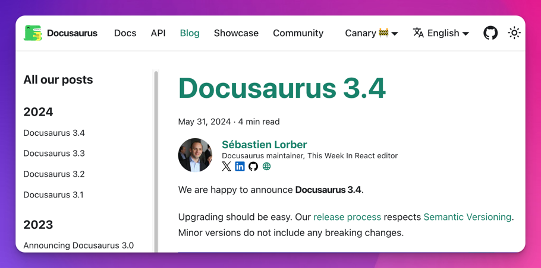

We are happy to announce **Docusaurus 3.5**.

This release contains many **new exciting blog features**.

Upgrading should be easy. Our [release process](/community/release-process) respects [Semantic Versioning](https://semver.org/). Minor versions do not include any breaking changes.


## Highlights

### Blog Social Icons

In [#10222](https://github.com/facebook/docusaurus/pull/10222), we added the possibility to associate social links to blog authors, for inline authors declared in front matter or global through the `authors.yml` file.

```yml title="blog/authors.yml"
slorber:
  name: Sébastien Lorber
  # other author properties...
  # highlight-start
  socials:
    x: sebastienlorber
    linkedin: sebastienlorber
    github: slorber
    newsletter: https://thisweekinreact.com
  # highlight-end
```


Icons and handle shortcuts are provided for pre-defined platforms `x`, `linkedin`, `github` and `stackoverflow`. It's possible to provide any additional platform entry (like `newsletter` in the example above) with a full URL.

### Blog Authors Pages

In [#10216](https://github.com/facebook/docusaurus/pull/10216), we added the possibility for [global blog authors](/docs/blog#global-authors) (declared in `authors.yml`) to have their own dedicated page listing all the blog posts they contributed to.

This feature is opt-in and mostly relevant for **multi-author blogs**. You can turn it on for a specific author by setting the `page: true` property:

```yml title="blog/authors.yml"
slorber:
  name: Sébastien Lorber
  # the description will be displayed on the author's page
  description: 'A freelance React and React-Native developer...'
  # highlight-next-line
  page: true # Turns the feature on
```

This creates a [dedicated author page](/blog/authors/slorber) at `/blog/authors/slorber`.


An [authors index page](/blog/authors) is also created, listing all the blog authors.


Check the [blog authors pages guide](/docs/blog#authors-pages) for details.

### Blog Feeds Styling

In [#9252](https://github.com/facebook/docusaurus/pull/9252), we added support for [styling your blog feeds](https://darekkay.com/blog/rss-styling/) by providing custom XSLT `.xls` files for the RSS and Atom feeds. This allows browsers to render the feeds in a more visually appealing way, like a regular HTML page, instead of the default XML view.

```js title="website/docusaurus.config.js"
const blogOptions = {
  feedOptions: {
    // highlight-start
    xslt: {
      rss: 'custom-rss.xsl',
      atom: 'custom-atom.xsl',
    },
    // highlight-end
  },
};
```

Writing your own XSLT can be complex, but you can also use `xslt: true` to turn on the built-in style:

```js title="website/docusaurus.config.js"
const blogOptions = {
  feedOptions: {
    // highlight-start
    xslt: true,
    // highlight-end
  },
};
```


### Blog Sidebar Grouping

In [#10252](https://github.com/facebook/docusaurus/pull/10252), we added support for grouping blog posts by years in the blog sidebar.



This feature is now turned on by default, but can be disabled with `themeConfig.blog.sidebar.groupByYear: false`.

### Blog Consistency Options

We added new blog options to enforce recommended practices for your blog posts:

#### `onInlineAuthors`

我們相信大型多作者部落格若使用宣告於 `authors.yml` 的[全域作者](/docs/blog#global-authors)，將更易於管理。這尤其能避免在多篇部落格文章中重複作者資訊，並現在可生成[作者專頁](/docs/blog#authors-pages)。

在 [#10224](https://github.com/facebook/docusaurus/pull/10224) 中，我們新增了 `onInlineAuthors` 選項。使用 `onInlineAuthors: 'throw'` 可禁止[行內作者](/docs/blog#inline-authors)，並強制一致使用[全域作者](/docs/blog#global-authors)。

#### `onUntruncatedBlogPosts`

我們認為部落格文章最好使用[截斷標記](/docs/blog#blog-list)（`<!-- truncate -->` 或 `{/* truncate */}`）。在分頁列表（部落格首頁、標籤頁面、作者頁面）上，這能呈現更簡潔的文章預覽，而非完整文章內容。

在 [#10375](https://github.com/facebook/docusaurus/pull/10375) 中，我們新增了 `onUntruncatedBlogPosts` 選項。使用 `onUntruncatedBlogPosts: 'throw'` 可強制一致使用[截斷標記](/docs/blog#blog-list)。

## 翻譯更新

- 🇪🇪 [#10339](https://github.com/facebook/docusaurus/pull/10339)：新增愛沙尼亞語主題翻譯。
- 🇮🇩 [#10325](https://github.com/facebook/docusaurus/pull/10325)：新增印尼語主題翻譯。
- 🇪🇸 [#10360](https://github.com/facebook/docusaurus/pull/10360)：改進西班牙語主題翻譯。
- 🇩🇪 [#10235](https://github.com/facebook/docusaurus/pull/10235)：改進德語主題翻譯。
- 🇨🇳 [#10257](https://github.com/facebook/docusaurus/pull/10257)：改進繁體中文（zh-Hant）主題翻譯。

## 其他變更

其他重要變更包括：

- [#10369](https://github.com/facebook/docusaurus/pull/10369)：新增支援 [pkg.pr.new](https://pkg.pr.new) 持續發布，讓您能在 StackBlitz 遊樂場測試任何拉取請求的程式碼。
- [#10376](https://github.com/facebook/docusaurus/pull/10376)：開發環境也會顯示未列出/草稿橫幅，避免您忘記發布內容。
- [#10335](https://github.com/facebook/docusaurus/pull/10335)：Markdown 頂層標題 `# title` 會自動包裹在 `<header>` 中，與 front matter 的 `title: Title` 保持一致。
- [#10286](https://github.com/facebook/docusaurus/pull/10286)：允許 Docusaurus 插件透過返回 `null` 自行停用。
- [#10241](https://github.com/facebook/docusaurus/pull/10241)：新增支援 [MDX 處理器 `recmaPlugins` 選項](https://mdxjs.com/packages/mdx/#processoroptions)，可修改 MDX Estree 抽象語法樹。
- [#10324](https://github.com/facebook/docusaurus/pull/10324)：文件自動生成的 `_category_.json` 接受新屬性 `description`，會顯示在生成的索引頁面上。
- [#10368](https://github.com/facebook/docusaurus/pull/10368)：CLI 指令 `docusaurus --version` 現在實際回傳 Docusaurus 版本號。
- [#10240](https://github.com/facebook/docusaurus/pull/10240)：Markdown `mdx-code-block` 現在支援縮排。
- [#10219](https://github.com/facebook/docusaurus/pull/10219)：修復 `<TabItem lazy>` 對 `className` 屬性的支援。
- [#10313](https://github.com/facebook/docusaurus/pull/10313)：部落格相關的 `@docusaurus/theme-common/internal` API 已移至 `@docusaurus/plugin-content-blog/client`。
- [#10316](https://github.com/facebook/docusaurus/pull/10316)：文件相關的 `@docusaurus/theme-common/internal` API 已移至 `@docusaurus/plugin-content-docs/client`。

查閱 **[3.5.0 版本更新日誌](/changelog/3.5.0)** 以獲取完整的變更清單。