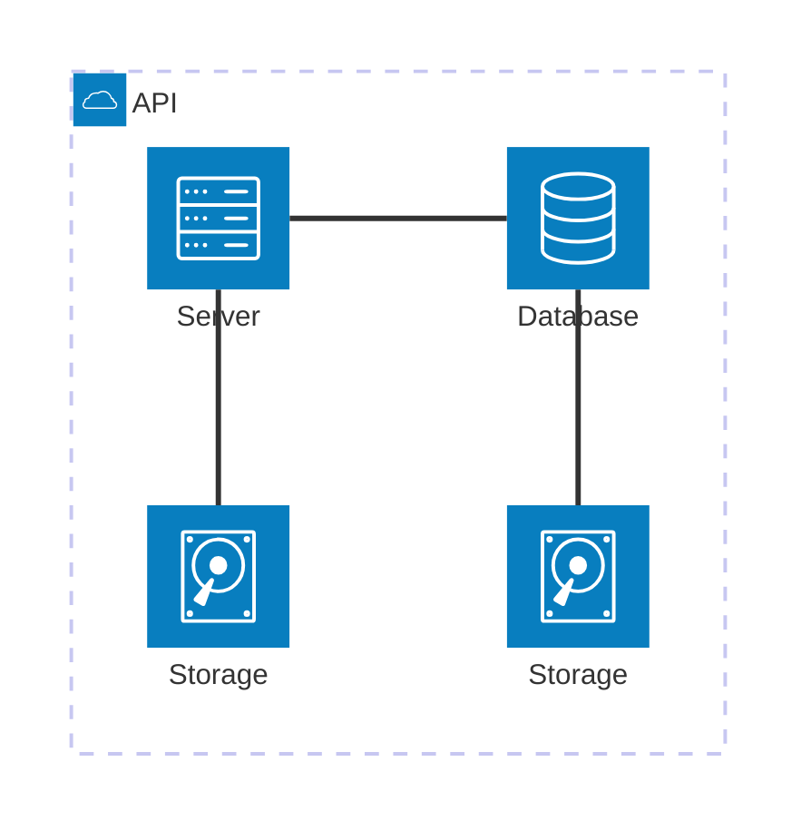

我們很高興宣布 **Docusaurus 3.6** 正式發布。

現在 Docusaurus 能 ⚡️⚡️⚡️ **更快速地** 構建您的網站。

升級過程應該很簡單。我們的[發布流程](/community/release-process)遵循[語意化版本控制](https://semver.org/)。次要版本更新不會包含任何破壞性變更。


## 重點更新

此版本主要透過 [Docusaurus Faster](https://github.com/facebook/docusaurus/issues/10556) 專案來提升建置效能。

## Docusaurus Faster

[Docusaurus Faster](https://github.com/facebook/docusaurus/issues/10556) 專案的目標是減少建置時間與記憶體消耗。

我們進行了多項優化，並將基礎架構現代化以採用更快速的 Rust 工具，特別是：

- 🦀 [Rspack](https://rspack.dev/)：基於 Rust 的快速網頁打包工具，幾乎可無縫取代 [webpack](https://webpack.js.org/)
- 🦀 [SWC](https://swc.rs/)：高速 Web 編譯器，基於 Rust 的網頁開發平台（HTML、CSS、JS）
- 🦀 [Lightning CSS](https://lightningcss.dev/)：極速 CSS 解析器、轉換器、打包工具與壓縮器

### 影響層面

採用新基礎架構可能帶來多種影響。無法在此一一列舉，因此我們聚焦於主要變更。

為協助您順利遷移，我們在靜態網站輸出結果與[瀏覽器支援](/docs/browser-support)方面採取了相對保守的策略。

#### 建置時間

社群網站基準測試顯示，正式環境建置速度可達 ⚡️**2 至 4 倍提升**！🔥：

- [React Native 官網](https://github.com/facebook/react-native-website/pull/4268)：快 3.04 倍 🔥
- [Babel 官網](https://github.com/babel/website/pull/2997)：快 3.27 倍 🔥
- [Lexical 官網](https://github.com/facebook/lexical/pull/6761)：快 2 倍 🔥

[如何進行基準測試](https://github.com/facebook/docusaurus/issues/10556#issuecomment-2407671873)

:::note[關於重建]

[Rspack 尚未支援持久化快取](https://rspack.dev/misc/planning/roadmap#persistent-cache)，但已列入開發路線圖且即將實作。考慮到 Rspack 的冷建置通常與啟用持久化快取的 Webpack 熱建置速度相當，我們認為這不影響採用 Rspack 的決策。

:::

#### 記憶體消耗

您應該也會注意到記憶體使用效率的提升：

- 新基礎架構整體消耗更少記憶體
- 我們修復了影響多語言站點的嚴重[記憶體洩漏問題](https://github.com/facebook/docusaurus/pull/10599)
- 新增[CI 檢查](https://github.com/facebook/docusaurus/pull/10601)確保不會出現效能衰退，且我們的網站與初始化模板都能在記憶體受限環境中建置
- 新增[內部工具](https://github.com/facebook/docusaurus/pull/10590)以更清楚分析建置過程中的記憶體消耗環節
- [移除了可能隱藏第三方插件記憶體洩漏的 `process.exit(0)`](https://github.com/facebook/docusaurus/pull/10410)

#### 其他影響

- HTML 壓縮工具現在會[在遇到無效的 HTML 標記時發出警告](https://github.com/facebook/docusaurus/discussions/10580)
- 靜態 HTML 輸出檔案[縮小了約 5%](https://github.com/facebook/docusaurus/pull/10554)
- 新基礎架構自動修復了部分錯誤

### 採用策略

這套新基礎架構屬於破壞性變更，但採用自願參與機制，無需升級至 Docusaurus 新主版本。

使用 Docusaurus Faster 前，請先新增此套件：

```bash npm2yarn
npm install @docusaurus/faster
```

為協助您**在 Docusaurus v3 下逐步採用**，我們引入了一組可漸進啟用的功能旗標。

建議透過此簡易布林捷徑一次性啟用所有功能：

```js
const config = {
  future: {
    experimental_faster: true,
  },
};
```

若某旗標與您的網站不相容，亦可獨立啟用各功能旗標：

```ts
const config = {
  future: {
    experimental_faster: {
      swcJsLoader: true,
      swcJsMinimizer: true,
      swcHtmlMinimizer: true,
      lightningCssMinimizer: true,
      rspackBundler: true,
      mdxCrossCompilerCache: true,
    },
  },
};
```

- [`swcJsLoader`](https://github.com/facebook/docusaurus/pull/10435)：使用 [SWC](https://swc.rs/) 轉譯 JS（取代 [Babel](https://babeljs.io/)）
- [`swcJsMinimizer`](https://github.com/facebook/docusaurus/pull/10441)：使用 [SWC](https://swc.rs/) 壓縮 JS（取代 [Terser](https://github.com/terser/terser)）
- [`swcHtmlMinimizer`](https://github.com/facebook/docusaurus/pull/10554)：使用 [SWC](https://swc.rs/) 壓縮 HTML 及內聯 JS/CSS（取代 [html-minifier-terser](https://github.com/terser/html-minifier-terser)）
- [`lightningCssMinimizer`](https://github.com/facebook/docusaurus/pull/10522)：使用 [Lightning CSS](https://lightningcss.dev/) 壓縮 CSS（取代 [cssnano](https://github.com/cssnano/cssnano) 與 [clean-css](https://github.com/clean-css/clean-css)）
- [`rspackBundler`](https://github.com/facebook/docusaurus/pull/10402)：使用 [Rspack](https://rspack.dev/) 打包應用（取代 [webpack](https://webpack.js.org/)）
- [`mdxCrossCompilerCache`](https://github.com/facebook/docusaurus/pull/10479)：MDX 檔案僅編譯一次即可同時用於瀏覽器/Node.js 環境

:::tip[實驗性但安全]

無需擔心啟用此功能。實驗性質僅限於配置選項。

新基礎架構經過 CI 管線嚴格測試，具備高穩定性。[Docusaurus 官網](https://docusaurus.io/)已投入生產環境使用，我們也計劃在 Meta 其他技術文件站點部署。

:::

#### 外掛程式相容性

新基礎架構採用 [Rspack](https://rspack.dev/)。巧合的是，Rspack 與 [webpack](https://webpack.js.org/) 幾乎 100% 相容，應不會破壞現有外掛程式生態。

多數 Docusaurus 外掛程式應可與 Rspack 直接相容，包括實作 [`configureWebpack`](/docs/api/plugin-methods/lifecycle-apis#configureWebpack) 的外掛程式。

但部分外掛程式需微調以確保相容性。核心原則是避免直接導入 `webpack`，改為使用「動態提供」的 webpack 實例：

```diff
-import webpack from 'webpack';

export default function (context, options) {
  return {
    name: 'custom-docusaurus-plugin',
-   configureWebpack(config, isServer) {
+   configureWebpack(config, isServer, {currentBundler}) {
      return {
        plugins: [
-         new webpack.DefinePlugin({}),
+         new currentBundler.instance.DefinePlugin({}),
        ]
      };
    },
  };
}
```

:::tip[致外掛程式開發者]

請查閱[專題討論](https://github.com/facebook/docusaurus/issues/10572)獲取指南與支援。

:::

### 後續規劃

這僅是開端：我們將持續推進 [Docusaurus Faster](https://github.com/facebook/docusaurus/issues/10556) 專案，現已規劃多項效能優化方案。

根據[您的反饋](https://github.com/facebook/docusaurus/issues/10556)，我們計劃在即將推出的 Docusaurus 主要版本中將此新基礎設施設為預設選項。

🙏 我們要感謝所有這些優秀工具的開發者，他們幫助我們讓 Docusaurus 變得比以往更快。特別是 [Rspack 團隊](https://rspack.dev/misc/team/core-team)，他們在整個過程中給予了我們支持，迅速處理了我們的反饋，並實現了我們所需的所有缺失功能，使這一切成為可能。👏

## Rsdoctor 插件

在 [#10588](https://github.com/facebook/docusaurus/pull/10588) 中，我們為 [Rsdoctor](https://rsdoctor.dev/) 創建了一個 Docusaurus 插件。它分析 Docusaurus 的打包階段，幫助您找出在加載器、插件和壓縮器方面拖慢打包速度的原因。它適用於 webpack 和 Rspack。


要使用它，請安裝新的 [`@docusaurus/plugin-rsdoctor`](/docs/api/plugins/@docusaurus/plugin-rsdoctor) 套件，然後在您的配置中使用該插件：

```ts title="docusaurus.config.js"
export default {
  plugins: [
    [
      'rsdoctor',
      {
        /* options */
      },
    ],
  ],
};
```

:::tip

根據環境變量有條件地啟用它：

```ts title="docusaurus.config.js"
export default {
  plugins: [
    process.env.RSDOCTOR === 'true' && [
      'rsdoctor',
      {
        /* options */
      },
    ],
  ],
};
```

```bash
# 不使用 Rsdoctor 進行構建
npm run build

# 使用 Rsdoctor 進行構建
RSDOCTOR=true npm run build
```

:::

## Mermaid

在 [#10510](https://github.com/facebook/docusaurus/pull/10510) 中，我們放寬了對 [Mermaid 圖表](https://mermaid.js.org/) 的依賴範圍限制，允許使用較新主要版本的 Mermaid。我們現在支持 Mermaid 10/11，並預計未來的版本也能兼容，讓您可以按自己的節奏升級。

這解鎖了新型圖表，例如[架構圖](https://mermaid.js.org/syntax/architecture)：



## 翻譯

- 🇸🇮 [#10551](https://github.com/facebook/docusaurus/pull/10551)：改進斯洛文尼亞語主題翻譯。
- 🇻🇳 [#10507](https://github.com/facebook/docusaurus/pull/10507)：改進越南語主題翻譯。
- 🇪🇸 [#10413](https://github.com/facebook/docusaurus/pull/10413)：改進西班牙語主題翻譯。

## 其他變更

其他值得注意的變更包括：

- [#10586](https://github.com/facebook/docusaurus/pull/10586)：博客支持 `frontMatter.title_meta` 以覆蓋 `frontMatter.title` 以滿足 SEO 需求。
- [#10600](https://github.com/facebook/docusaurus/pull/10600)：`docusaurus build` 和 `docusaurus deploy` 現在支持多個 `--locale` CLI 參數。
- [#10454](https://github.com/facebook/docusaurus/pull/10454)：`docusaurus-remark-plugin-npm2yarn` 升級至 [`npm-to-yarn` v3](https://github.com/nebrelbug/npm-to-yarn/releases/tag/v3.0.0)，並可以轉換 `npx` 命令。
- [#10612](https://github.com/facebook/docusaurus/pull/10612)：Canary 版本將使用 `3.5.2-canary-<number>` 而非 `0.0.0-canary-<number>`，以尊重插件的 `peerDependency` 限制。
- [#10547](https://github.com/facebook/docusaurus/pull/10547)：`@docusaurus/tsconfig` 升級至 `target: 'es2022'`。
- [#10514](https://github.com/facebook/docusaurus/pull/10514)：從 Docusaurus 初始化模板中移除 `babel.config.js`，以不鼓勵自定義 Babel。

查看 **[3.6.0 版本更新日誌](/changelog/3.6.0)** 以獲取完整的變更清單。