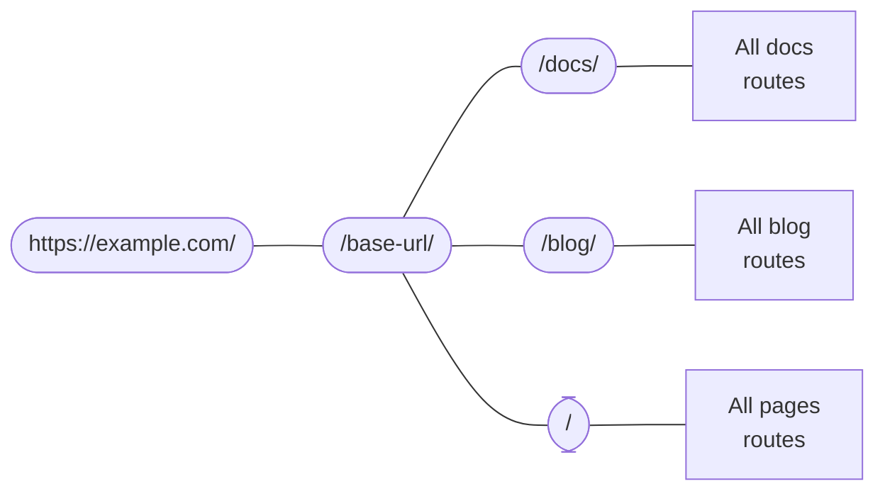

# 路由系統

```mdx-code-block
import Link from '@docusaurus/Link';
import {useLatestVersion, useActiveDocContext} from '@docusaurus/plugin-content-docs/client';
import {useLocation} from '@docusaurus/router';
import BrowserWindow from '@site/src/components/BrowserWindow';
```

Docusaurus 的路由系統遵循單頁應用程式慣例：一個路由對應一個元件。本節將先說明三種內容外掛（文檔、部落格和頁面）內的路由機制，接著深入探討底層路由系統的運作原理。

## 內容外掛中的路由 {#routing-in-content-plugins}

每個內容外掛都提供 `routeBasePath` 選項，用於定義外掛附加路由的基礎路徑。預設情況下，文檔外掛的路由置於 `/docs` 下；部落格外掛置於 `/blog`；頁面外掛則置於 `/`。您可以將路由結構視為：



系統會將所有路由與此嵌套路由配置進行匹配，直到找到相符項目。例如當處理 `/docs/configuration` 路由時，Docusaurus 會先進入 `/docs` 分支，接著在文檔外掛創建的子路由中搜尋。

變更 `routeBasePath` 可有效調整網站路由結構。例如在[純文檔模式](../guides/docs/docs-introduction.mdx#docs-only-mode)中，將文檔外掛設為 `routeBasePath: '/'` 意味著文檔路由將不再帶有 `/docs` 前綴，但仍可透過其他外掛建立如 `/blog` 的子路由。

接下來我們將分別說明這三種外掛如何組織其「子路由區塊」。

### 頁面路由 {#pages-routing}

頁面路由最為直觀：檔案路徑直接映射至 URL，無法另行客製化。詳見[頁面文件](../guides/creating-pages.mdx#routing)。

Markdown 頁面使用 `@theme/MDXPage` 元件，React 頁面則直接作為路由元件使用。

### 部落格路由 {#blog-routing}

部落格外掛會建立以下路由：

- **文章列表頁**：`/`、`/page/2`、`/page/3`...
  - 可透過 `pageBasePath` 選項自訂路由。
  - 使用元件為 `@theme/BlogListPage`。
- **單篇文章頁**：`/2021/11/21/algolia-docsearch-migration`、`/2021/05/12/announcing-docusaurus-two-beta`...
  - 由各篇 Markdown 文章生成。
  - 路由可透過 front matter 中的 `slug` 完全自訂。
  - 使用元件為 `@theme/BlogPostPage`。
- **標籤列表頁**：`/tags`
  - 可透過 `tagsBasePath` 選項自訂路由。
  - 使用元件為 `@theme/BlogTagsListPage`。
- **標籤頁面**：`/tags/adoption`、`/tags/beta`...
  - 根據文章 front matter 中定義的標籤生成。
  - 路由基礎路徑由 `tagsBasePath` 定義，子路由可透過標籤的 `permalink` 欄位自訂。
  - 使用元件為 `@theme/BlogTagsPostsPage`。
- **歸檔頁**：`/archive`
  - 可透過 `archiveBasePath` 選項自訂路由。
  - 使用元件為 `@theme/BlogArchivePage`。

### 文檔路由 {#docs-routing}

文檔外掛是唯一會建立**嵌套路由**的外掛。頂層會註冊[版本路徑](../guides/docs/versioning.mdx)：`/`、`/next`、`/2.0.0-beta.13`... 這些路徑提供版本上下文（包含版面配置與側邊欄），確保切換文檔時能保持側邊欄狀態，並可透過導覽列下拉選單切換版本而不離開當前文檔。使用的元件為 `@theme/DocPage`。

```mdx-code-block
export const URLPath = () => <code>{useLocation().pathname}</code>;

export const FilePath = () => {
  const currentVersion = useActiveDocContext('default').activeVersion.name;
  return <code>{currentVersion === 'current' ? './docs/' : `./versioned_docs/version-${currentVersion}/`}advanced/routing.md</code>;
}
```

個別文檔會渲染在導覽列、頁尾、側邊欄等由 `DocPage` 元件提供的框架之後的剩餘空間。例如本頁面 <URLPath /> 即由 <FilePath /> 檔案生成。使用的元件為 `@theme/DocItem`。

文件的 `slug` 前置元數據可自訂路由的最後部分，但基礎路由始終由插件的 `routeBasePath` 和版本的 `path` 定義。

### 檔案路徑與 URL 路徑 {#file-paths-and-url-paths}

在整個文件中，我們始終力求明確區分檔案路徑和 URL 路徑。內容插件通常會將檔案路徑直接映射到 URL 路徑，例如 `./docs/advanced/routing.md` 會變成 `/docs/advanced/routing`。然而，透過 `slug` 設定，您可以讓 URL 完全與檔案結構脫鉤。

在 Markdown 中撰寫連結時，您可能指的是 _檔案路徑_ 或 _URL 路徑_，Docusaurus 會使用多種啟發式方法來判斷。

- 若路徑帶有 `@site` 前綴，則 _必定_ 是資源檔案路徑。
- 若路徑帶有 `http(s)://` 前綴，則 _必定_ 是 URL 路徑。
- 若路徑沒有副檔名，則視為 URL 路徑。例如，在 URL 為 `/docs/advanced/routing` 的頁面上，連結 `[page](../plugins)` 會指向 `/docs/plugins`。Docusaurus 僅在建置站點時（當其知曉完整路由結構後）檢測失效連結，但不會對檔案存在與否做任何假設。這完全等同於在 JSX 檔案中寫入 `<a href="../plugins">page</a>`。
- 若路徑帶有 `.md(x)` 副檔名，Docusaurus 會嘗試將該 Markdown 檔案解析為 URL，並將檔案路徑替換為 URL 路徑。
- 若路徑帶有任何其他副檔名，Docusaurus 會將其視為 [資源檔案](../guides/markdown-features/markdown-features-assets.mdx) 並進行打包。

以下目錄結構可幫助您直觀理解這種檔案→URL的映射關係。假設所有頁面均未使用 `slug` 自訂功能。

<details>

<summary>A sample site structure</summary>

```bash
.
├── blog                            # blog plugin has routeBasePath: '/blog'
│   ├── 2019-05-28-first-blog-post.md       # -> /blog/2019/05/28/first-blog-post
│   ├── 2019-05-29-long-blog-post.md        # -> /blog/2019/05/29/long-blog-post
│   ├── 2021-08-01-mdx-blog-post.mdx        # -> /blog/2021/08/01/mdx-blog-post
│   └── 2021-08-26-welcome
│       ├── docusaurus-plushie-banner.jpeg
│       └── index.md                        # -> /blog/2021/08/26/welcome
├── docs                            # docs plugin has routeBasePath: '/docs'; current version has base path '/'
│   ├── intro.md                            # -> /docs/intro
│   ├── tutorial-basics
│   │   ├── _category_.json
│   │   ├── congratulations.md              # -> /docs/tutorial-basics/congratulations
│   │   └── markdown-features.mdx           # -> /docs/tutorial-basics/markdown-features
│   └── tutorial-extras
│       ├── _category_.json
│       ├── manage-docs-versions.md         # -> /docs/tutorial-extras/manage-docs-versions
│       └── translate-your-site.md          # -> /docs/tutorial-extras/translate-your-site
├── src
│   └── pages                       # pages plugin has routeBasePath: '/'
│       ├── index.module.css
│       ├── index.tsx                       # -> /
│       └── markdown-page.md                # -> /markdown-page
└── versioned_docs
    └── version-1.0.0               # version has base path '/1.0.0'
        ├── intro.md                        # -> /docs/1.0.0/intro
        ├── tutorial-basics
        │   ├── _category_.json
        │   ├── congratulations.md          # -> /docs/1.0.0/tutorial-basics/congratulations
        │   └── markdown-features.mdx       # -> /docs/1.0.0/tutorial-basics/markdown-features
        └── tutorial-extras
            ├── _category_.json
            ├── manage-docs-versions.md     # -> /docs/1.0.0/tutorial-extras/manage-docs-versions
            └── translate-your-site.md      # -> /docs/1.0.0/tutorial-extras/translate-your-site
```

</details>

關於內容插件的說明至此為止。現在讓我們退後一步，談談 Docusaurus 應用程式中路由的通用運作原理。

## 路由轉換為 HTML 檔案 {#routes-become-html-files}

由於 Docusaurus 是伺服器端渲染框架，所有生成的路由都會被伺服器端渲染成靜態 HTML 檔案。若您熟悉 [Apache2](https://httpd.apache.org/docs/trunk/getting-started.html) 等 HTTP 伺服器的行為，就會理解其運作方式：當瀏覽器向路由 `/docs/advanced/routing` 發送請求時，伺服器會將其解讀為請求 HTML 檔案 `/docs/advanced/routing/index.html` 並返回該檔案。

路由 `/docs/advanced/routing` 可能對應 `/docs/advanced/routing/index.html` 或 `/docs/advanced/routing.html`。部分託管服務商會根據結尾斜線的存在與否進行區分，且可能不兼容另一種形式。詳見 [結尾斜線指南](https://github.com/slorber/trailing-slash-guide)。

例如，上述目錄結構的建置輸出如下（忽略其他資源和 JS 打包檔案）：

<details>

<summary>Output of the above workspace</summary>

```bash
build
├── 404.html                      # /404/
├── blog
│   ├── archive
│   │   └── index.html            # /blog/archive/
│   ├── first-blog-post
│   │   └── index.html            # /blog/first-blog-post/
│   ├── index.html                # /blog/
│   ├── long-blog-post
│   │   └── index.html            # /blog/long-blog-post/
│   ├── mdx-blog-post
│   │   └── index.html            # /blog/mdx-blog-post/
│   ├── tags
│   │   ├── docusaurus
│   │   │   └── index.html        # /blog/tags/docusaurus/
│   │   ├── hola
│   │   │   └── index.html        # /blog/tags/hola/
│   │   └── index.html            # /blog/tags/
│   └── welcome
│       └── index.html            # /blog/welcome/
├── docs
│   ├── 1.0.0
│   │   ├── intro
│   │   │   └── index.html        # /docs/1.0.0/intro/
│   │   ├── tutorial-basics
│   │   │   ├── congratulations
│   │   │   │   └── index.html    # /docs/1.0.0/tutorial-basics/congratulations/
│   │   │   └── markdown-features
│   │   │       └── index.html    # /docs/1.0.0/tutorial-basics/markdown-features/
│   │   └── tutorial-extras
│   │       ├── manage-docs-versions
│   │       │   └── index.html    # /docs/1.0.0/tutorial-extras/manage-docs-versions/
│   │       └── translate-your-site
│   │           └── index.html    # /docs/1.0.0/tutorial-extras/translate-your-site/
│   ├── intro
│   │   └── index.html            # /docs/1.0.0/intro/
│   ├── tutorial-basics
│   │   ├── congratulations
│   │   │   └── index.html        # /docs/tutorial-basics/congratulations/
│   │   └── markdown-features
│   │       └── index.html        # /docs/tutorial-basics/markdown-features/
│   └── tutorial-extras
│       ├── manage-docs-versions
│       │   └── index.html        # /docs/tutorial-extras/manage-docs-versions/
│       └── translate-your-site
│           └── index.html        # /docs/tutorial-extras/translate-your-site/
├── index.html                    # /
└── markdown-page
    └── index.html                # /markdown-page/
```

</details>

若 `trailingSlash` 設為 `false`，建置時會生成 `intro.html` 而非 `intro/index.html`。

所有 HTML 檔案都會使用絕對路徑引用其 JS 資源，因此為了正確定位資源，您必須配置 `baseUrl` 欄位。請注意 `baseUrl` 不會影響打包輸出的檔案結構：基礎 URL 位於 Docusaurus 路由系統的上層。您可以將 `url` 和 `baseUrl` 的組合視為 Docusaurus 站點的實際位置。

舉例來說，產生的 HTML 檔案會包含如 `<link rel="preload" href="/assets/js/runtime~main.7ed5108a.js" as="script">` 的連結。由於絕對 URL 是從主機端解析，若打包檔案被放置在 `https://example.com/base/` 路徑下，該連結會指向 `https://example.com/assets/js/runtime~main.7ed5108a.js`（顯然不存在）。透過指定 `/base/` 作為基礎 URL，連結才能正確指向 `/base/assets/js/runtime~main.7ed5108a.js`。

本地化網站的基礎 URL 也會包含語系代碼。例如 `https://docusaurus.io/zh-CN/docs/advanced/routing/` 的基礎 URL 為 `/zh-CN/`。

## 路由的生成與存取 {#generating-and-accessing-routes}

`addRoute` 生命週期方法用於生成路由。它會向路由樹註冊一組路由配置，包含路由路徑、對應元件及元件所需的 props。props 和元件都以打包工具可 `require` 的路徑形式提供，如[架構概述](architecture.mdx)所述，伺服器與客戶端僅透過暫存檔案溝通。

所有路由會匯總至 `.docusaurus/routes.js`，可透過除錯外掛的[路由面板](/__docusaurus/debug/routes)檢視。

在客戶端，我們提供 `@docusaurus/router` 來存取頁面路由。該套件是 [`react-router-dom`](https://www.npmjs.com/package/react-router-dom/v/5.3.0) 的重新導出。例如可用 `useLocation` 取得當前頁面的[位置物件](https://developer.mozilla.org/en-US/docs/Web/API/Location)，或用 `useHistory` 存取[歷史物件](https://developer.mozilla.org/en-US/docs/Web/API/History)（功能類似瀏覽器 API 但實作不同，詳見 React Router 文件）。

此 API 具備 **SSR 安全性**，與僅限瀏覽端的 `window.location` 不同。

```jsx title="myComponent.js"
import React from 'react';
import {useLocation} from '@docusaurus/router';

export function PageRoute() {
  // React router provides the current component's route, even in SSR
  const location = useLocation();
  return (
    <span>
      We are currently on <code>{location.pathname}</code>
    </span>
  );
}
```

```mdx-code-block
export function PageRoute() {
  const location = useLocation();
  return (
    <span>
      We are currently on <code>{location.pathname}</code>
    </span>
  );
}

<BrowserWindow>

<PageRoute />

</BrowserWindow>
```

## 脫離 SPA 重新導向機制 {#escaping-from-spa-redirects}

Docusaurus 建構的是[單頁應用程式](https://developer.mozilla.org/en-US/docs/Glossary/SPA)，路由轉換透過 React Router 的 `history.push()` 方法在客戶端完成。此操作前提是目標 URL 必須被路由器識別，否則路由器會攔截路徑並顯示 404 頁面。

若將 HTML 頁面置於 `static` 資料夾，它們會被複製到建構輸出中而成為網站可存取內容，但不屬於 Docusaurus 路由系統。我們提供 `pathname://` 協定，讓你能以非 SPA 方式重新導向至網域其他部分，如同外部連結般運作。

```md
- [pathname:///pure-html](pathname:///pure-html)
```

<BrowserWindow>

- [`pathname:///pure-html`](pathname:///pure-html)

</BrowserWindow>

`pathname://` 協定特別適用於參照 static 資料夾內的任何內容。例如 Docusaurus 會將[所有 Markdown 靜態資源轉為 require() 呼叫](../guides/markdown-features/markdown-features-assets.mdx#static-assets)，而此協定可保持原始連結形式，避免被 Webpack 雜湊處理。

```md title="my-doc.md"


[An asset from the static](pathname:///files/asset.pdf)
```

Docusaurus 僅會移除 `pathname://` 前綴，不會處理後續內容。